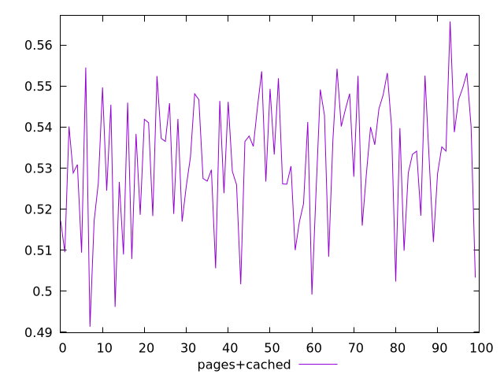
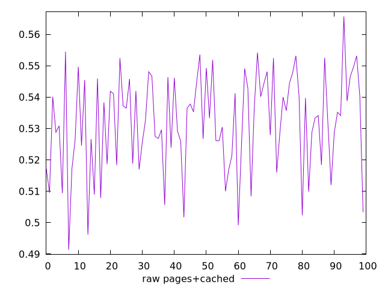
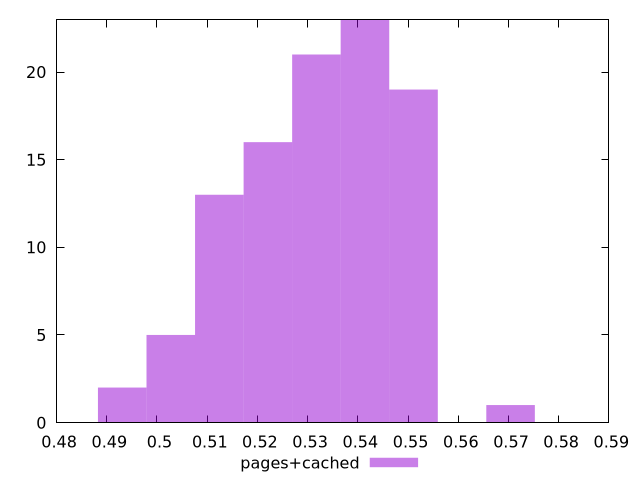

# Report pages+cached

[parent..](./..)  


## Scores

  

## Score Histogram

  

## Score Indicators

```yaml
min: 0.4913536541653386
max: 0.5657115031025787
range: 0.07435784893724007
mean: 0.5318723561861073
median: 0.533736289169291
stdev: 0.015503423254760975
skewness: -0.4484118846468988
eccentricity: 1.6343100089382674
quanta: 100
quantaRatio: 1
p90range: 0.04555388238770686
p90stdev: 0.5354747771765397
p90eccentricity: 1.6343100089382674
p90quanta: 90
p90quantaRatio: 1
outlandishness: 0.9901709551078146

```

## Raw Values

  

## Raw Values Histogram

  

## Raw Indicators

```yaml
min: 0.4913536541653386
max: 0.5657115031025787
range: 0.07435784893724007
mean: 0.5318723561861073
median: 0.533736289169291
stdev: 0.015503423254760975
skewness: -0.4484118846468988
eccentricity: 1.6343100089382674
quanta: 100
quantaRatio: 1
p90range: 0.04555388238770686
p90stdev: 0.5354747771765397
p90eccentricity: 1.6343100089382674
p90quanta: 90
p90quantaRatio: 1
outlandishness: 0.9901709551078146

```

<style>
  img {
    max-width: 80%;
  }
</style>
      
