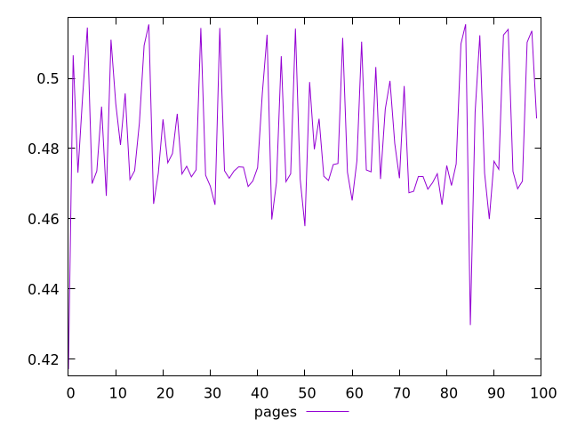
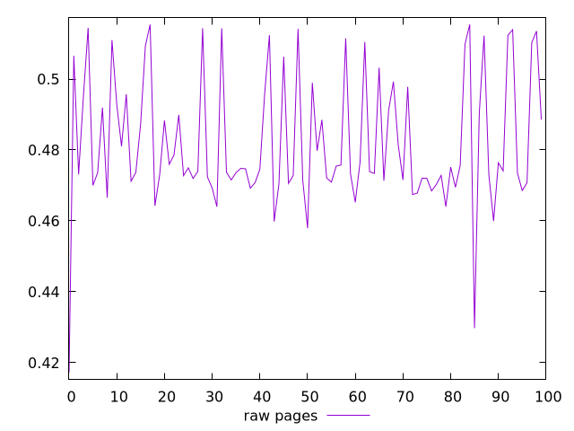

# Report pages

[parent..](./..)  


## Scores

  

## Score Histogram

  

## Score Indicators

```yaml
min: 0.4172165056100327
max: 0.515383004754315
range: 0.09816649914428227
mean: 0.4818645311027645
median: 0.47433295627962796
stdev: 0.018574246443533966
skewness: 0.07029053697375931
eccentricity: 1.462648843674168
quanta: 100
quantaRatio: 1
p90range: 0.05445348431152086
p90stdev: 0.47379840732323125
p90eccentricity: 1.462648843674168
p90quanta: 90
p90quantaRatio: 1
outlandishness: 1.0066595998466592

```

## Raw Values

  

## Raw Values Histogram

  

## Raw Indicators

```yaml
min: 0.4172165056100327
max: 0.515383004754315
range: 0.09816649914428227
mean: 0.4818645311027645
median: 0.47433295627962796
stdev: 0.018574246443533966
skewness: 0.07029053697375931
eccentricity: 1.462648843674168
quanta: 100
quantaRatio: 1
p90range: 0.05445348431152086
p90stdev: 0.47379840732323125
p90eccentricity: 1.462648843674168
p90quanta: 90
p90quantaRatio: 1
outlandishness: 1.0066595998466592

```

<style>
  img {
    max-width: 80%;
  }
</style>
      
