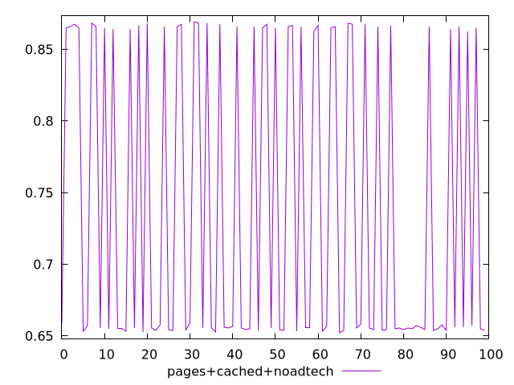
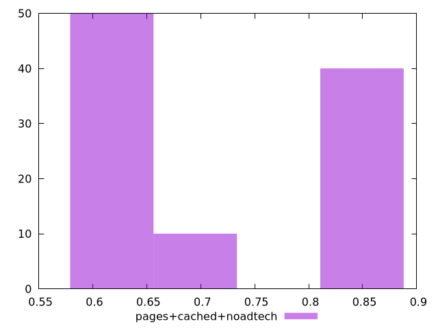
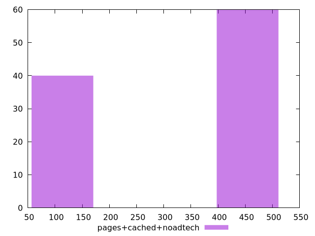

# Report pages+cached+noadtech

[parent..](./..)  


## Scores

  

## Score Histogram

  

## Score Indicators

```yaml
min: 0.6522222222222223
max: 0.8691666666666666
range: 0.21694444444444438
mean: 0.7395555555555555
median: 0.6563888888888889
stdev: 0.10335446319210596
skewness: 0.40813860710419597
eccentricity: 1.6426748544202712
quanta: 22
quantaRatio: 0.22
p90range: 0.21527777777777768
p90stdev: 0.6555555555555556
p90eccentricity: 1.6426748544202712
p90quanta: 20
p90quantaRatio: 0.2222222222222222
outlandishness: 1.0397682740093184

```

## Raw Values

  

## Raw Values Histogram

  

## Raw Indicators

```yaml
min: 157
max: 476
range: 319
mean: 346.67
median: 468.5
stdev: 151.90326230861538
skewness: -0.40786037176815576
eccentricity: 1.6448626329852618
quanta: 22
quantaRatio: 0.22
p90range: 317
p90stdev: 470
p90eccentricity: 1.6448626329852618
p90quanta: 20
p90quantaRatio: 0.2222222222222222
outlandishness: 0.889368033362895

```

<style>
  img {
    max-width: 80%;
  }
</style>
      
