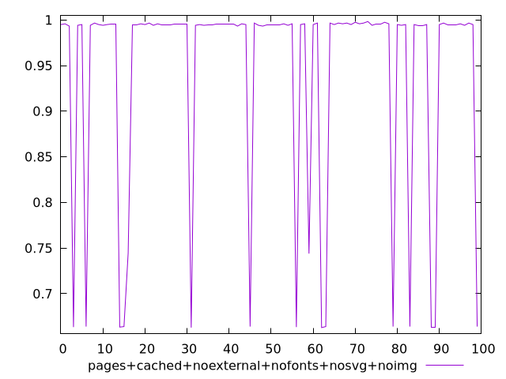
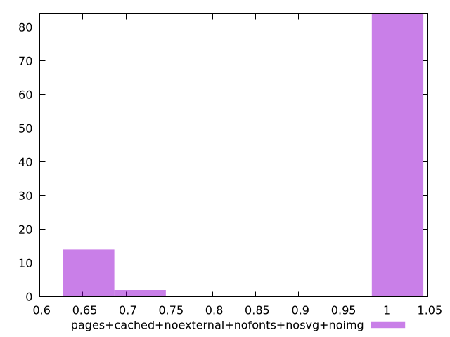
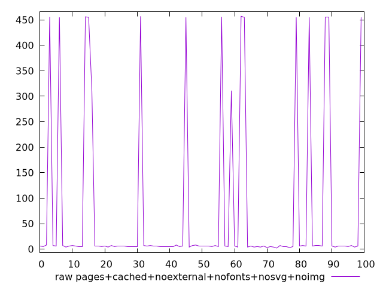
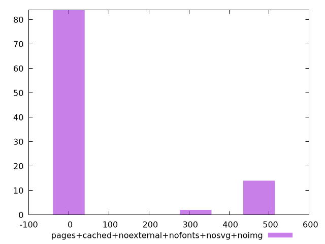

# Report pages+cached+noexternal+nofonts+nosvg+noimg

[parent..](./..)  


## Scores

  

## Score Histogram

  

## Score Indicators

```yaml
min: 0.6627777777777778
max: 0.9983333333333333
range: 0.3355555555555555
mean: 0.943869444444445
median: 0.995
stdev: 0.11843504532620303
skewness: -1.8835064469217797
eccentricity: 0.8786344516903514
quanta: 12
quantaRatio: 0.12
p90range: 0.33444444444444443
p90stdev: 0.995
p90eccentricity: 0.8786344516903514
p90quanta: 10
p90quantaRatio: 0.1111111111111111
outlandishness: 0.9370966341173643

```

## Raw Values

  

## Raw Values Histogram

  

## Raw Indicators

```yaml
min: 2
max: 457
range: 455
mean: 74.69
median: 6
stdev: 159.50678324134054
skewness: 1.9035100671439364
eccentricity: 0.8748217296117753
quanta: 12
quantaRatio: 0.12
p90range: 453
p90stdev: 6
p90eccentricity: 0.8748217296117753
p90quanta: 10
p90quantaRatio: 0.1111111111111111
outlandishness: 5.336099999999998

```

<style>
  img {
    max-width: 80%;
  }
</style>
      
