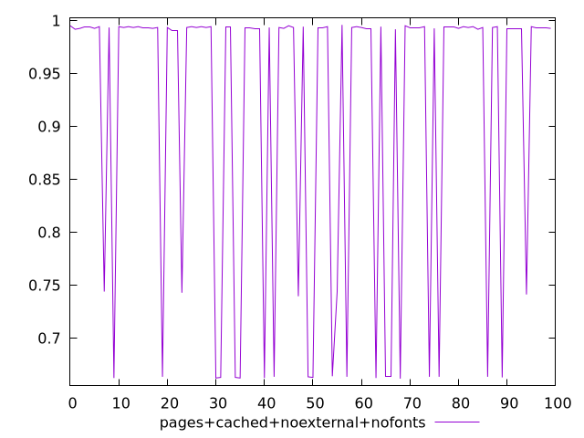
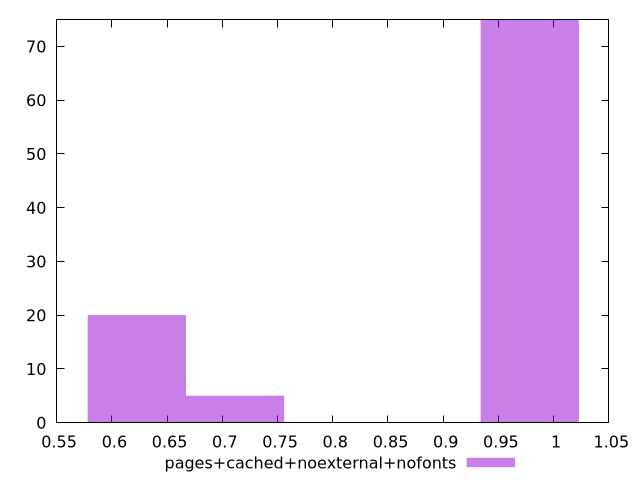
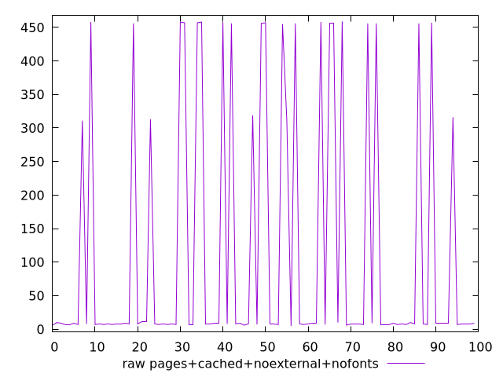
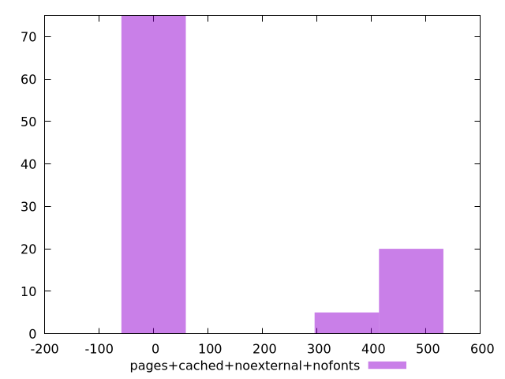

# Report pages+cached+noexternal+nofonts

[parent..](./..)  


## Scores

  

## Score Histogram

  

## Score Indicators

```yaml
min: 0.6616666666666666
max: 0.9958333333333333
range: 0.3341666666666667
mean: 0.9147305555555562
median: 0.9933333333333333
stdev: 0.13716406468325482
skewness: -1.1959365532984627
eccentricity: 1.153889851454248
quanta: 16
quantaRatio: 0.16
p90range: 0.3325
p90stdev: 0.9933333333333333
p90eccentricity: 1.153889851454248
p90quanta: 13
p90quantaRatio: 0.14444444444444443
outlandishness: 0.9414044115679386

```

## Raw Values

  

## Raw Values Histogram

  

## Raw Indicators

```yaml
min: 5
max: 459
range: 454
mean: 113.01
median: 8
stdev: 184.22966617784434
skewness: 1.2254701114893343
eccentricity: 1.146937973583601
quanta: 16
quantaRatio: 0.16
p90range: 451
p90stdev: 8
p90eccentricity: 1.146937973583601
p90quanta: 13
p90quantaRatio: 0.14444444444444443
outlandishness: 2.288038664849929

```

<style>
  img {
    max-width: 80%;
  }
</style>
      
