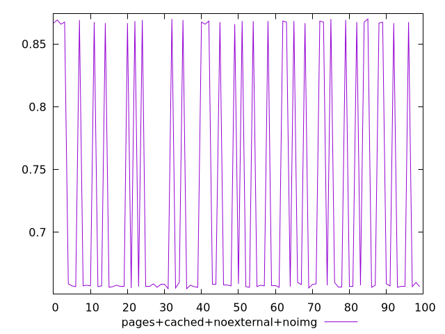
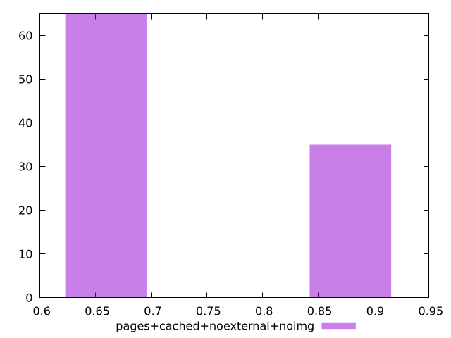
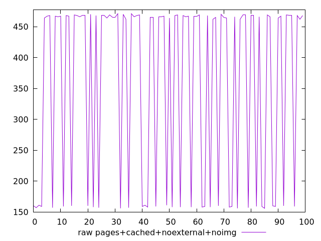
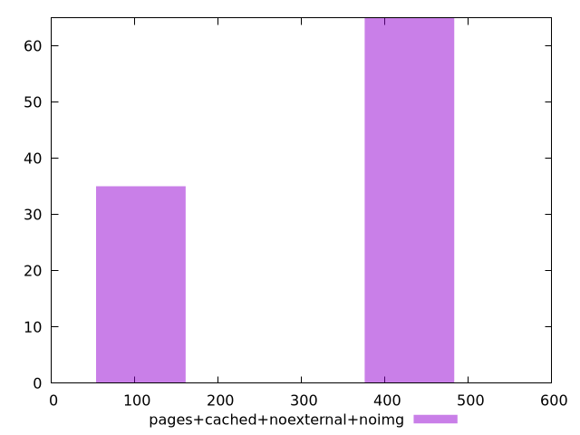

# Report pages+cached+noexternal+noimg

[parent..](./..)  


## Scores

  

## Score Histogram

  

## Score Indicators

```yaml
min: 0.655
max: 0.87
range: 0.21499999999999997
mean: 0.730961111111111
median: 0.6580555555555556
stdev: 0.10046099313651694
skewness: 0.6288358850310057
eccentricity: 1.4777432605490812
quanta: 15
quantaRatio: 0.15
p90range: 0.21333333333333326
p90stdev: 0.6577777777777778
p90eccentricity: 1.4777432605490812
p90quanta: 13
p90quantaRatio: 0.14444444444444443
outlandishness: 1.0434055083591802

```

## Raw Values

  

## Raw Values Histogram

  

## Raw Indicators

```yaml
min: 156
max: 471
range: 315
mean: 359.02
median: 465.5
stdev: 147.1011883024743
skewness: -0.6286460935801416
eccentricity: 1.480069620867487
quanta: 15
quantaRatio: 0.15
p90range: 313
p90stdev: 466
p90eccentricity: 1.480069620867487
p90quanta: 13
p90quantaRatio: 0.14444444444444443
outlandishness: 0.8857247838231449

```

<style>
  img {
    max-width: 80%;
  }
</style>
      
