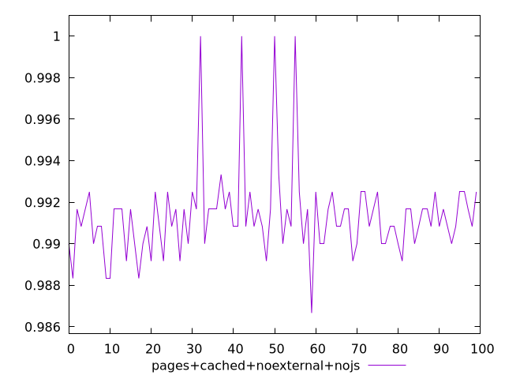
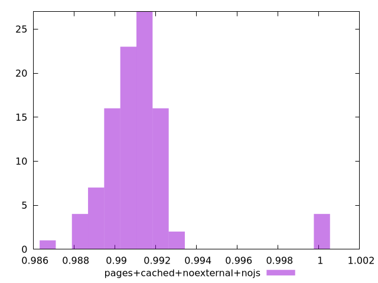
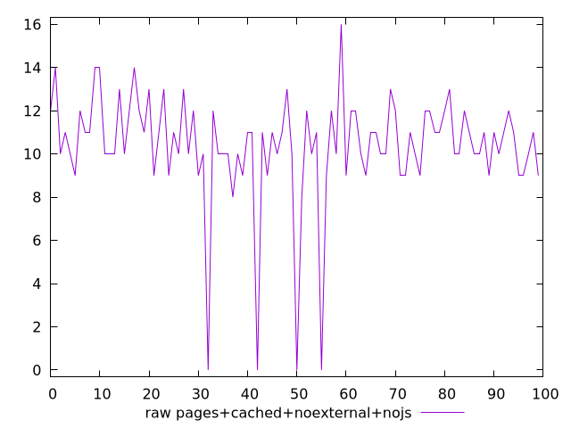
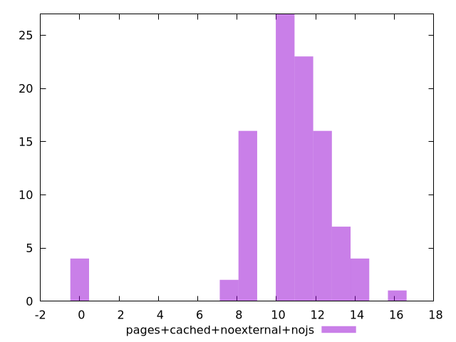

# Report pages+cached+noexternal+nojs

[parent..](./..)  


## Scores

  

## Score Histogram

  

## Score Indicators

```yaml
min: 0.9866666666666667
max: 1
range: 0.013333333333333308
mean: 0.9913499999999987
median: 0.9908333333333333
stdev: 0.002140158353435048
skewness: 2.348098077992045
eccentricity: 1.2148633748652489
quanta: 9
quantaRatio: 0.09
p90range: 0.004166666666666652
p90stdev: 0.99125
p90eccentricity: 1.2148633748652489
p90quanta: 6
p90quantaRatio: 0.06666666666666667
outlandishness: 1.0003512784265522

```

## Raw Values

  

## Raw Values Histogram

  

## Raw Indicators

```yaml
min: 0
max: 16
range: 16
mean: 10.38
median: 11
stdev: 2.5681900241220474
skewness: -2.348098077990305
eccentricity: 1.2148633748651805
quanta: 9
quantaRatio: 0.09
p90range: 5
p90stdev: 10.5
p90eccentricity: 1.2148633748651805
p90quanta: 6
p90quantaRatio: 0.06666666666666667
outlandishness: 0.9609348068561314

```

<style>
  img {
    max-width: 80%;
  }
</style>
      
