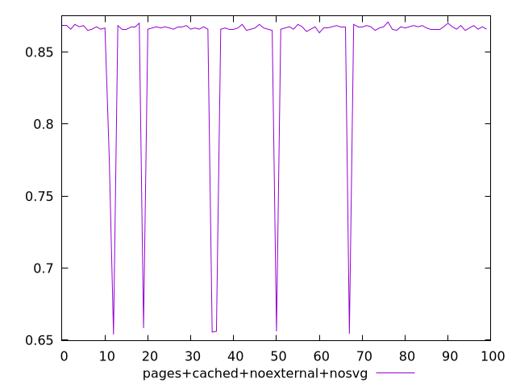
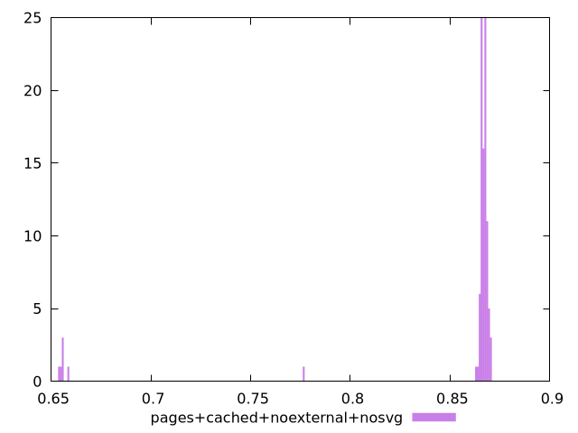
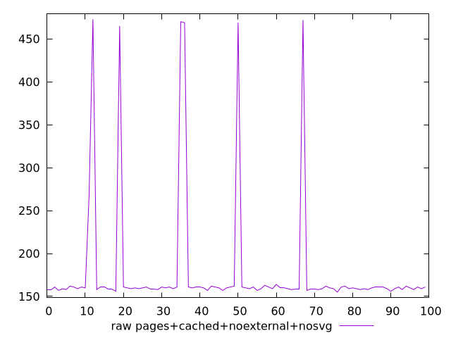
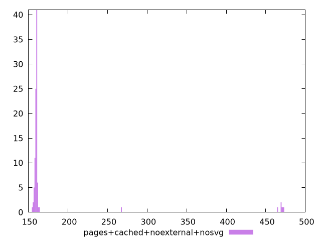

# Report pages+cached+noexternal+nosvg

[parent..](./..)  


## Scores

  

## Score Histogram

  

## Score Indicators

```yaml
min: 0.6538888888888889
max: 0.8708333333333333
range: 0.2169444444444445
mean: 0.8533694444444445
median: 0.8666666666666667
stdev: 0.05074831468040327
skewness: -3.5602975824404774
eccentricity: 0.573308584288395
quanta: 16
quantaRatio: 0.16
p90range: 0.005833333333333357
p90stdev: 0.8666666666666667
p90eccentricity: 0.573308584288395
p90quanta: 8
p90quantaRatio: 0.08888888888888889
outlandishness: 0.9691767125230801

```

## Raw Values

  

## Raw Values Histogram

  

## Raw Indicators

```yaml
min: 155
max: 473
range: 318
mean: 179.35
median: 160
stdev: 74.15300061359619
skewness: 3.6008397600971382
eccentricity: 0.5623508105530949
quanta: 16
quantaRatio: 0.16
p90range: 7
p90stdev: 160
p90eccentricity: 0.5623508105530949
p90quanta: 8
p90quantaRatio: 0.08888888888888889
outlandishness: 1.2596480307831595

```

<style>
  img {
    max-width: 80%;
  }
</style>
      
