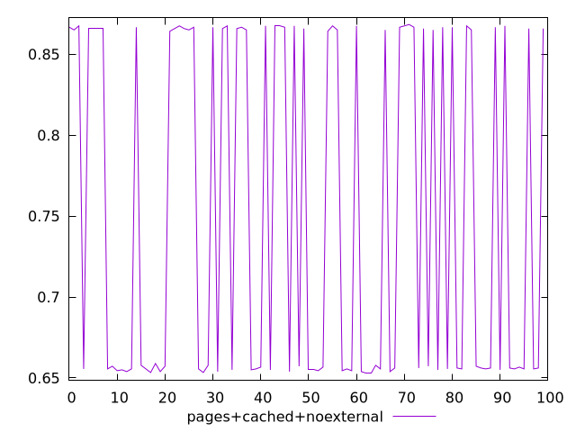
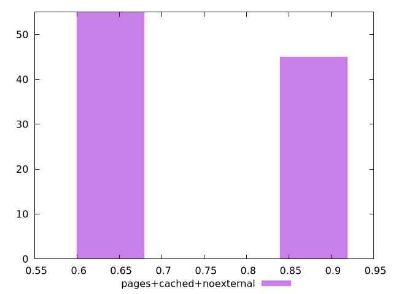
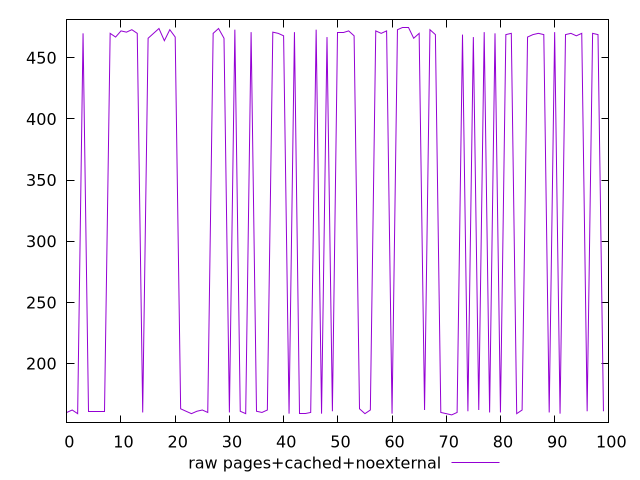
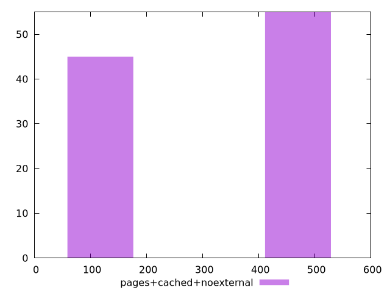

# Report pages+cached+noexternal

[parent..](./..)  


## Scores

  

## Score Histogram

  

## Score Indicators

```yaml
min: 0.6527777777777778
max: 0.8683333333333333
range: 0.2155555555555555
mean: 0.7503722222222221
median: 0.6572222222222223
stdev: 0.10489750450138119
skewness: 0.2008747988804339
eccentricity: 1.8135162913320733
quanta: 17
quantaRatio: 0.17
p90range: 0.21472222222222215
p90stdev: 0.6566666666666666
p90eccentricity: 1.8135162913320733
p90quanta: 16
p90quantaRatio: 0.17777777777777778
outlandishness: 1.0356370583665744

```

## Raw Values

  

## Raw Values Histogram

  

## Raw Indicators

```yaml
min: 158
max: 475
range: 317
mean: 330.74
median: 467
stdev: 154.0904682321395
skewness: -0.2007023357199606
eccentricity: 1.8145184657287083
quanta: 17
quantaRatio: 0.17
p90range: 316
p90stdev: 468
p90eccentricity: 1.8145184657287083
p90quanta: 16
p90quantaRatio: 0.17777777777777778
outlandishness: 0.8938220572377192

```

<style>
  img {
    max-width: 80%;
  }
</style>
      
