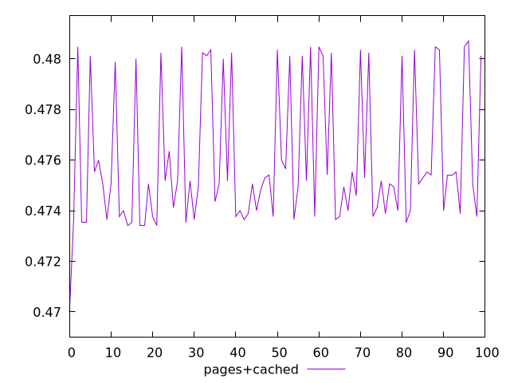
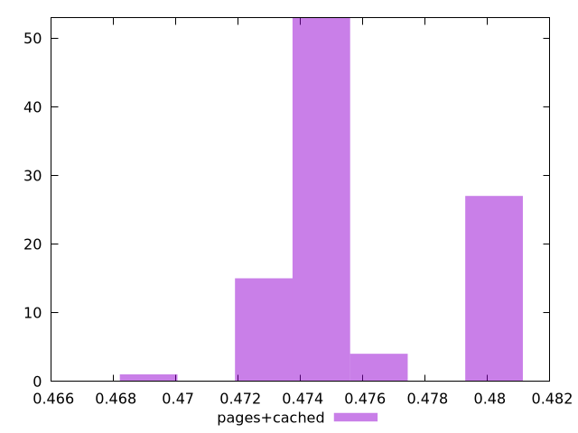
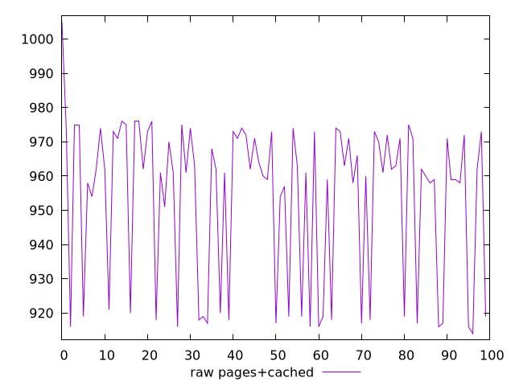
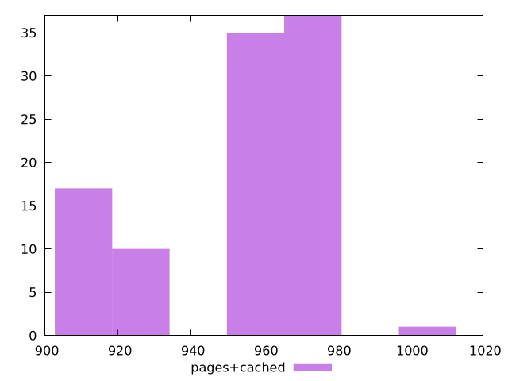

# Report pages+cached

[parent..](./..)  


## Scores

  

## Score Histogram

  

## Score Indicators

```yaml
min: 0.47
max: 0.4807058823529412
range: 0.010705882352941232
mean: 0.47602470588235285
median: 0.47505882352941176
stdev: 0.002707993805352402
skewness: 0.7055854313467972
eccentricity: 1.4936171103340654
quanta: 27
quantaRatio: 0.27
p90range: 0.006941176470588228
p90stdev: 0.47505882352941176
p90eccentricity: 1.4936171103340654
p90quanta: 24
p90quantaRatio: 0.26666666666666666
outlandishness: 1.0015885601353582

```

## Raw Values

  

## Raw Values Histogram

  

## Raw Indicators

```yaml
min: 914
max: 1005
range: 91
mean: 953.79
median: 962
stdev: 23.017947345495422
skewness: -0.7055854313466989
eccentricity: 1.4936171103340412
quanta: 27
quantaRatio: 0.27
p90range: 59
p90stdev: 962
p90eccentricity: 1.4936171103340412
p90quanta: 24
p90quantaRatio: 0.26666666666666666
outlandishness: 0.9933027869222982

```

<style>
  img {
    max-width: 80%;
  }
</style>
      
