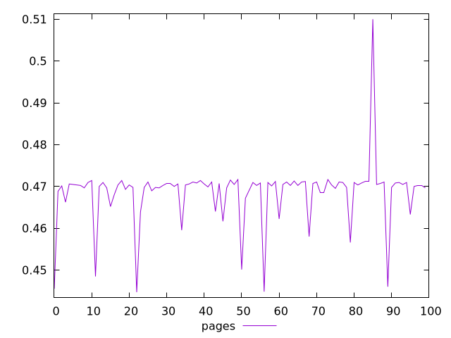
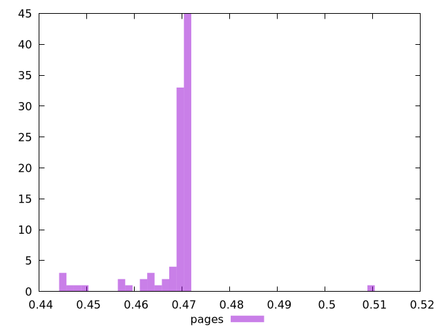
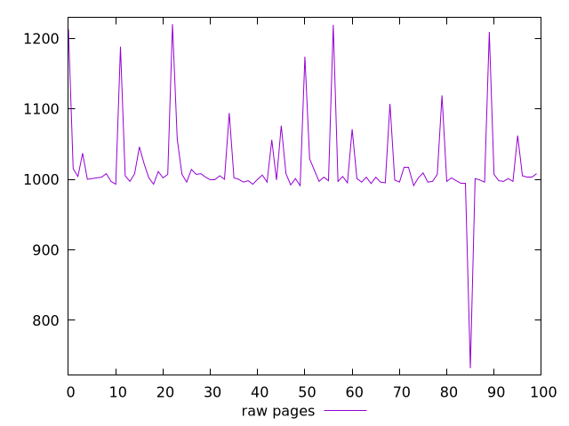
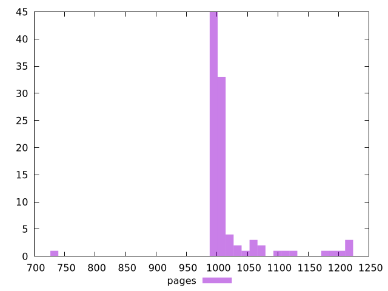

# Report pages

[parent..](./..)  


## Scores

  

## Score Histogram

  

## Score Indicators

```yaml
min: 0.4447058823529412
max: 0.51
range: 0.06529411764705884
mean: 0.46852000000000005
median: 0.4703529411764706
stdev: 0.0073993767623083155
skewness: 0.07249312088112413
eccentricity: 0.8553979568856811
quanta: 43
quantaRatio: 0.43
p90range: 0.010000000000000009
p90stdev: 0.47041176470588236
p90eccentricity: 0.8553979568856811
p90quanta: 33
p90quantaRatio: 0.36666666666666664
outlandishness: 0.9942650273340548

```

## Raw Values

  

## Raw Values Histogram

  

## Raw Indicators

```yaml
min: 732
max: 1220
range: 488
mean: 1018.25
median: 1002
stdev: 59.394675687303824
skewness: 0.8603477349216514
eccentricity: 0.8832441526608733
quanta: 43
quantaRatio: 0.43
p90range: 85
p90stdev: 1001.5
p90eccentricity: 0.8832441526608733
p90quanta: 33
p90quantaRatio: 0.36666666666666664
outlandishness: 1.0242758827656377

```

<style>
  img {
    max-width: 80%;
  }
</style>
      
