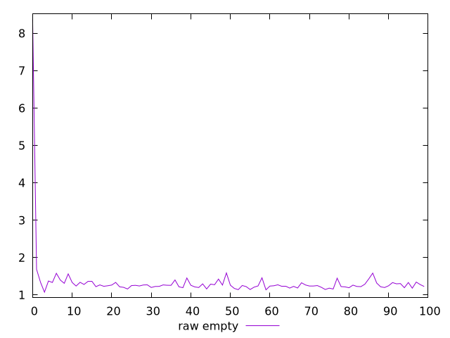
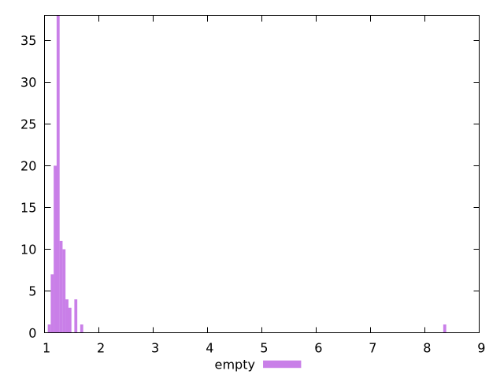

# Report empty

[parent..](./..)  


## Scores

  

## Score Histogram

  

## Score Indicators

```yaml
min: 1
max: 1
range: 0
mean: 1
median: 1
stdev: 0
skewness: .nan
eccentricity: .nan
quanta: 1
quantaRatio: 0.01
p90range: 0
p90stdev: 1
p90eccentricity: .nan
p90quanta: 1
p90quantaRatio: 0.011111111111111112
outlandishness: 1

```

## Raw Values

  

## Raw Values Histogram

  

## Raw Indicators

```yaml
min: 1.0739999999999998
max: 8.376999999999995
range: 7.3029999999999955
mean: 1.34652
median: 1.251
stdev: 0.7141804181017563
skewness: 9.537223405053515
eccentricity: 0.3942421170666767
quanta: 88
quantaRatio: 0.88
p90range: 0.31200000000000006
p90stdev: 1.25
p90eccentricity: 0.3942421170666767
p90quanta: 78
p90quantaRatio: 0.8666666666666667
outlandishness: 1.1344128647141816

```

<style>
  img {
    max-width: 80%;
  }
</style>
      
