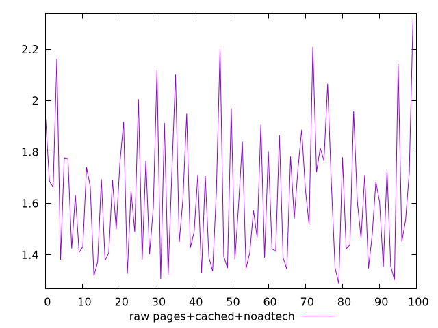
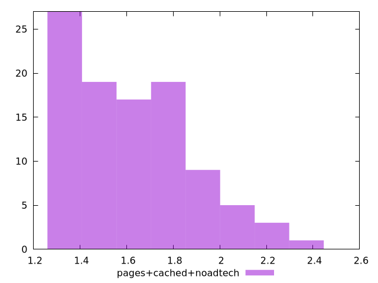

# Report pages+cached+noadtech

[parent..](./..)  


## Scores

  

## Score Histogram

  

## Score Indicators

```yaml
min: 1
max: 1
range: 0
mean: 1
median: 1
stdev: 0
skewness: .nan
eccentricity: .nan
quanta: 1
quantaRatio: 0.01
p90range: 0
p90stdev: 1
p90eccentricity: .nan
p90quanta: 1
p90quantaRatio: 0.011111111111111112
outlandishness: 1

```

## Raw Values

  

## Raw Values Histogram

  

## Raw Indicators

```yaml
min: 1.288
max: 2.319
range: 1.031
mean: 1.6229899999999997
median: 1.6065
stdev: 0.24920824605136965
skewness: 0.6999275284497054
eccentricity: 1.6669592863888156
quanta: 98
quantaRatio: 0.98
p90range: 0.6700000000000002
p90stdev: 1.5379999999999998
p90eccentricity: 1.6669592863888156
p90quanta: 88
p90quantaRatio: 0.9777777777777777
outlandishness: 1.0731793841934743

```

<style>
  img {
    max-width: 80%;
  }
</style>
      
