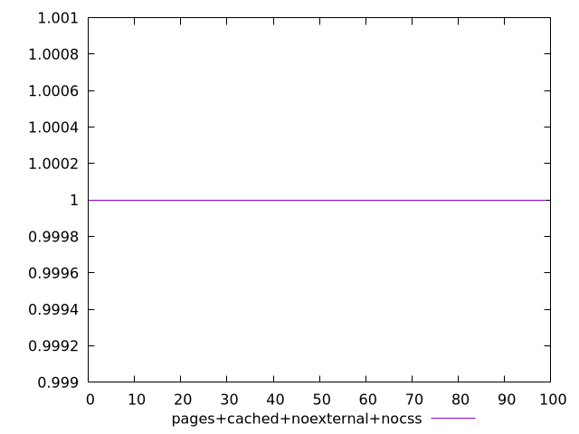

# Report pages+cached+noexternal+nocss

[parent..](./..)  


## Scores

  

## Score Histogram

  

## Score Indicators

```yaml
min: 1
max: 1
range: 0
mean: 1
median: 1
stdev: 0
skewness: .nan
eccentricity: .nan
quanta: 1
quantaRatio: 0.01
p90range: 0
p90stdev: 1
p90eccentricity: .nan
p90quanta: 1
p90quantaRatio: 0.011111111111111112
outlandishness: 1

```

## Raw Values

  

## Raw Values Histogram

  

## Raw Indicators

```yaml
min: 1.338
max: 2.473
range: 1.1349999999999998
mean: 1.7901399999999992
median: 1.7505000000000002
stdev: 0.19674216731549946
skewness: 0.705246119637584
eccentricity: 1.4278586224452416
quanta: 99
quantaRatio: 0.99
p90range: 0.6240000000000003
p90stdev: 1.7505000000000002
p90eccentricity: 1.4278586224452416
p90quanta: 89
p90quantaRatio: 0.9888888888888889
outlandishness: 1.0060804991691845

```

<style>
  img {
    max-width: 80%;
  }
</style>
      
