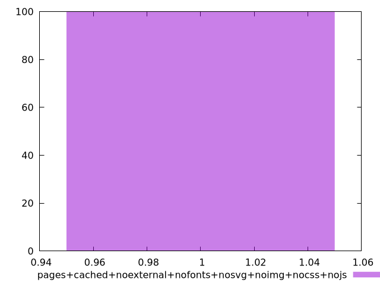
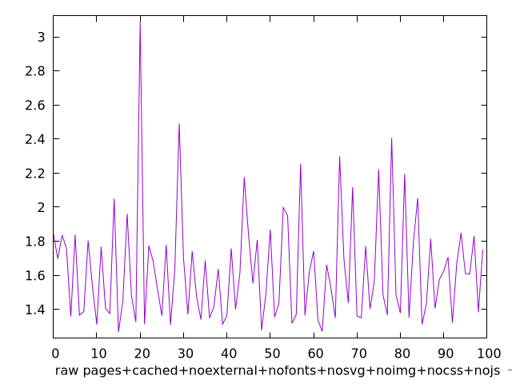
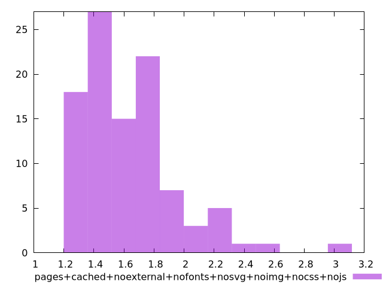

# Report pages+cached+noexternal+nofonts+nosvg+noimg+nocss+nojs

[parent..](./..)  


## Scores

  

## Score Histogram

  

## Score Indicators

```yaml
min: 1
max: 1
range: 0
mean: 1
median: 1
stdev: 0
skewness: .nan
eccentricity: .nan
quanta: 1
quantaRatio: 0.01
p90range: 0
p90stdev: 1
p90eccentricity: .nan
p90quanta: 1
p90quantaRatio: 0.011111111111111112
outlandishness: 1

```

## Raw Values

  

## Raw Values Histogram

  

## Raw Indicators

```yaml
min: 1.268
max: 3.088
range: 1.82
mean: 1.6314299999999997
median: 1.5705
stdev: 0.31633397715073225
skewness: 1.5409516076740584
eccentricity: 1.5280685443716053
quanta: 94
quantaRatio: 0.94
p90range: 0.7830000000000001
p90stdev: 1.506
p90eccentricity: 1.5280685443716053
p90quanta: 84
p90quantaRatio: 0.9333333333333333
outlandishness: 1.1024504439207303

```

<style>
  img {
    max-width: 80%;
  }
</style>
      
