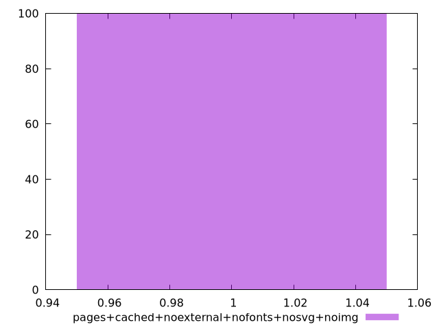
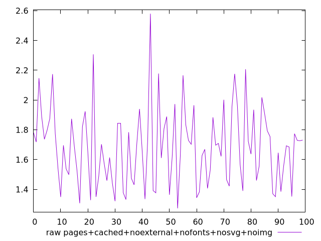
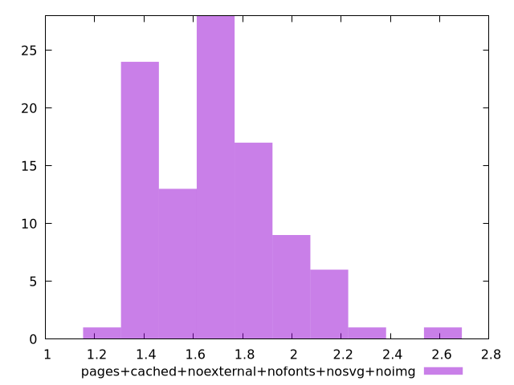

# Report pages+cached+noexternal+nofonts+nosvg+noimg

[parent..](./..)  


## Scores

  

## Score Histogram

  

## Score Indicators

```yaml
min: 1
max: 1
range: 0
mean: 1
median: 1
stdev: 0
skewness: .nan
eccentricity: .nan
quanta: 1
quantaRatio: 0.01
p90range: 0
p90stdev: 1
p90eccentricity: .nan
p90quanta: 1
p90quantaRatio: 0.011111111111111112
outlandishness: 1

```

## Raw Values

  

## Raw Values Histogram

  

## Raw Indicators

```yaml
min: 1.273
max: 2.58
range: 1.3070000000000002
mean: 1.6823899999999992
median: 1.6919999999999997
stdev: 0.2572429550055745
skewness: 0.6570456590358396
eccentricity: 1.5794407275067868
quanta: 94
quantaRatio: 0.94
p90range: 0.6969999999999998
p90stdev: 1.6604999999999999
p90eccentricity: 1.5794407275067868
p90quanta: 84
p90quantaRatio: 0.9333333333333333
outlandishness: 1.0505972457222754

```

<style>
  img {
    max-width: 80%;
  }
</style>
      
