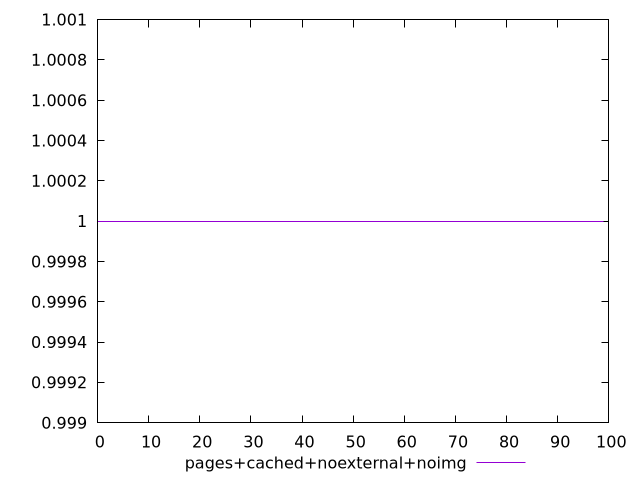
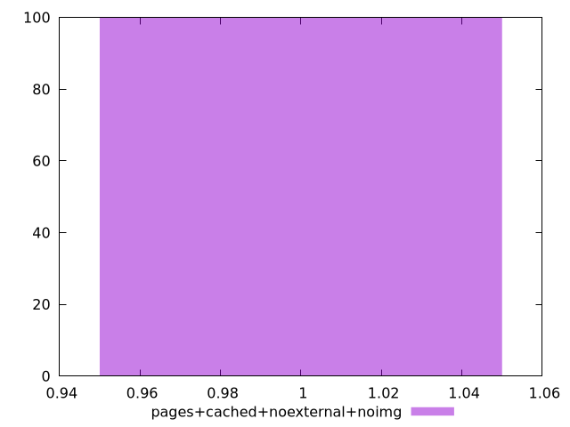
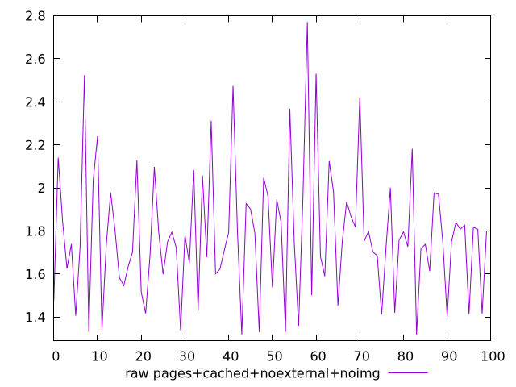
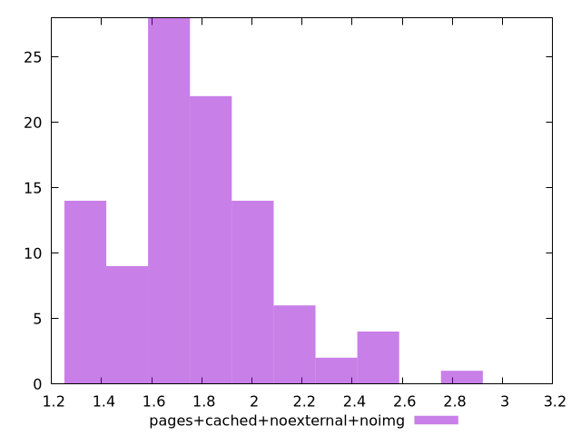

# Report pages+cached+noexternal+noimg

[parent..](./..)  


## Scores

  

## Score Histogram

  

## Score Indicators

```yaml
min: 1
max: 1
range: 0
mean: 1
median: 1
stdev: 0
skewness: .nan
eccentricity: .nan
quanta: 1
quantaRatio: 0.01
p90range: 0
p90stdev: 1
p90eccentricity: .nan
p90quanta: 1
p90quantaRatio: 0.011111111111111112
outlandishness: 1

```

## Raw Values

  

## Raw Values Histogram

  

## Raw Indicators

```yaml
min: 1.319
max: 2.7710000000000004
range: 1.4520000000000004
mean: 1.7797299999999998
median: 1.752
stdev: 0.29356382117011626
skewness: 0.7754281704353129
eccentricity: 1.4686414636569283
quanta: 93
quantaRatio: 0.93
p90range: 0.8520000000000001
p90stdev: 1.748
p90eccentricity: 1.4686414636569283
p90quanta: 84
p90quantaRatio: 0.9333333333333333
outlandishness: 1.0583992133430948

```

<style>
  img {
    max-width: 80%;
  }
</style>
      
