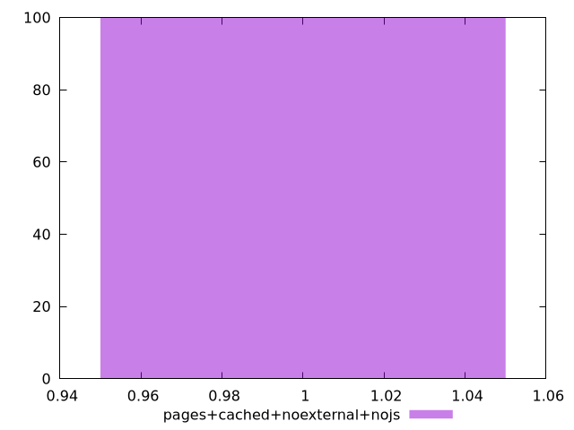

# Report pages+cached+noexternal+nojs

[parent..](./..)  


## Scores

  

## Score Histogram

  

## Score Indicators

```yaml
min: 1
max: 1
range: 0
mean: 1
median: 1
stdev: 0
skewness: .nan
eccentricity: .nan
quanta: 1
quantaRatio: 0.01
p90range: 0
p90stdev: 1
p90eccentricity: .nan
p90quanta: 1
p90quantaRatio: 0.011111111111111112
outlandishness: 1

```

## Raw Values

  

## Raw Values Histogram

  

## Raw Indicators

```yaml
min: 1.414
max: 2.398
range: 0.9840000000000002
mean: 1.8519700000000006
median: 1.8489999999999998
stdev: 0.17464469387874346
skewness: 0.4501351491411541
eccentricity: 1.5069452965042682
quanta: 98
quantaRatio: 0.98
p90range: 0.498
p90stdev: 1.8459999999999996
p90eccentricity: 1.5069452965042682
p90quanta: 88
p90quantaRatio: 0.9777777777777777
outlandishness: 1.0109276609597162

```

<style>
  img {
    max-width: 80%;
  }
</style>
      
