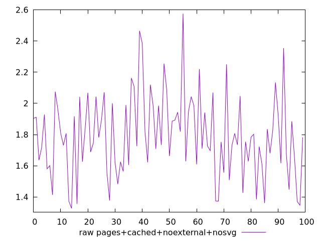
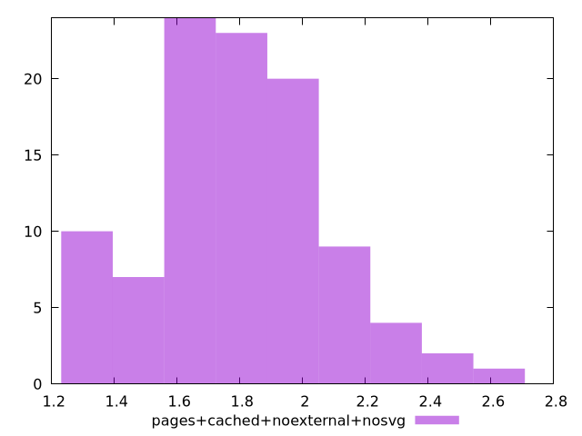

# Report pages+cached+noexternal+nosvg

[parent..](./..)  


## Scores

  

## Score Histogram

  

## Score Indicators

```yaml
min: 1
max: 1
range: 0
mean: 1
median: 1
stdev: 0
skewness: .nan
eccentricity: .nan
quanta: 1
quantaRatio: 0.01
p90range: 0
p90stdev: 1
p90eccentricity: .nan
p90quanta: 1
p90quantaRatio: 0.011111111111111112
outlandishness: 1

```

## Raw Values

  

## Raw Values Histogram

  

## Raw Indicators

```yaml
min: 1.327
max: 2.575
range: 1.2480000000000002
mean: 1.793000000000001
median: 1.7675
stdev: 0.2641143691660868
skewness: 0.3885964642169082
eccentricity: 1.5906745298503997
quanta: 95
quantaRatio: 0.95
p90range: 0.8500000000000003
p90stdev: 1.7535
p90eccentricity: 1.5906745298503997
p90quanta: 85
p90quantaRatio: 0.9444444444444444
outlandishness: 1.0219832489641143

```

<style>
  img {
    max-width: 80%;
  }
</style>
      
