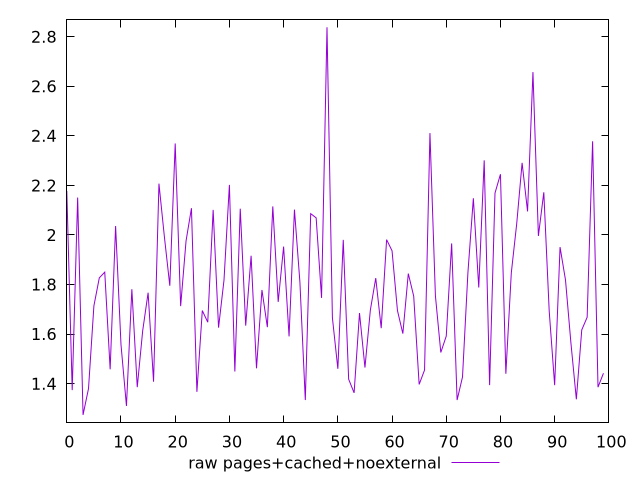
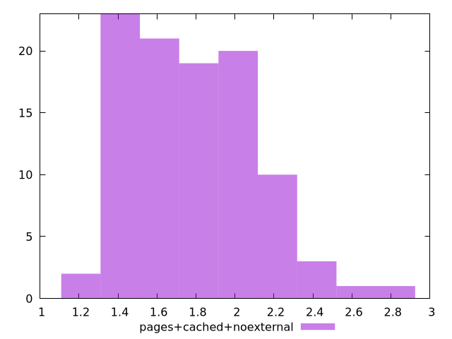

# Report pages+cached+noexternal

[parent..](./..)  


## Scores

  

## Score Histogram

  

## Score Indicators

```yaml
min: 1
max: 1
range: 0
mean: 1
median: 1
stdev: 0
skewness: .nan
eccentricity: .nan
quanta: 1
quantaRatio: 0.01
p90range: 0
p90stdev: 1
p90eccentricity: .nan
p90quanta: 1
p90quantaRatio: 0.011111111111111112
outlandishness: 1

```

## Raw Values

  

## Raw Values Histogram

  

## Raw Indicators

```yaml
min: 1.274
max: 2.838
range: 1.564
mean: 1.7857299999999992
median: 1.7540000000000002
stdev: 0.32246630382103497
skewness: 0.580790807855879
eccentricity: 1.6241697001949968
quanta: 98
quantaRatio: 0.98
p90range: 0.873
p90stdev: 1.722
p90eccentricity: 1.6241697001949968
p90quanta: 88
p90quantaRatio: 0.9777777777777777
outlandishness: 1.0546138602853414

```

<style>
  img {
    max-width: 80%;
  }
</style>
      
