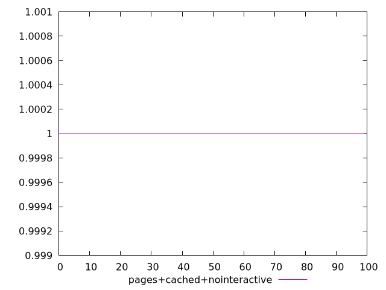
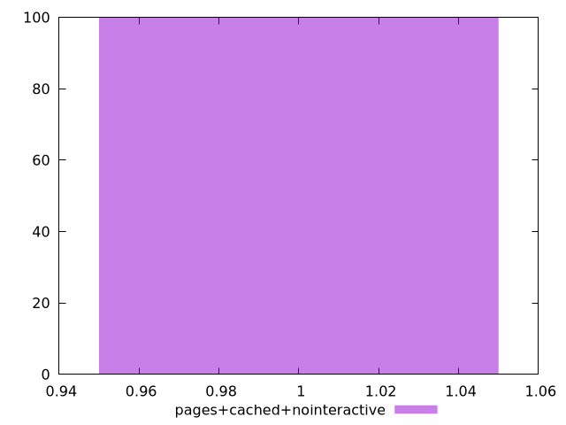

# Report pages+cached+nointeractive

[parent..](./..)  


## Scores

  

## Score Histogram

  

## Score Indicators

```yaml
min: 1
max: 1
range: 0
mean: 1
median: 1
stdev: 0
skewness: .nan
eccentricity: .nan
quanta: 1
quantaRatio: 0.01
p90range: 0
p90stdev: 1
p90eccentricity: .nan
p90quanta: 1
p90quantaRatio: 0.011111111111111112
outlandishness: 1

```

## Raw Values

  

## Raw Values Histogram

  

## Raw Indicators

```yaml
min: 1.218
max: 2.363
range: 1.145
mean: 1.5299300000000002
median: 1.4745
stdev: 0.20340365065553773
skewness: 1.4470498486255425
eccentricity: 1.4669353231290054
quanta: 95
quantaRatio: 0.95
p90range: 0.492
p90stdev: 1.4625
p90eccentricity: 1.4669353231290054
p90quanta: 85
p90quantaRatio: 0.9444444444444444
outlandishness: 1.0491455502045113

```

<style>
  img {
    max-width: 80%;
  }
</style>
      
