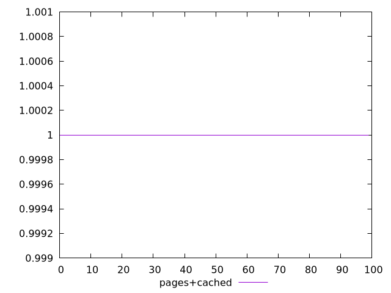
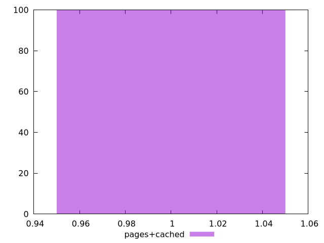
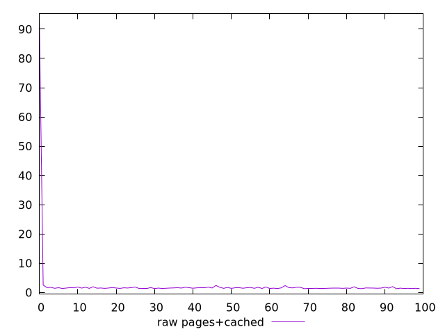
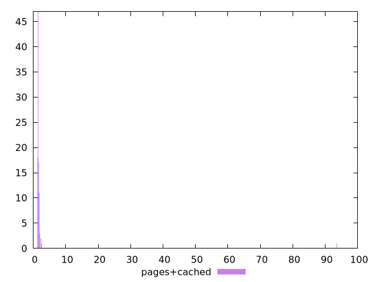

# Report pages+cached

[parent..](./..)  


## Scores

  

## Score Histogram

  

## Score Indicators

```yaml
min: 1
max: 1
range: 0
mean: 1
median: 1
stdev: 0
skewness: .nan
eccentricity: .nan
quanta: 1
quantaRatio: 0.01
p90range: 0
p90stdev: 1
p90eccentricity: .nan
p90quanta: 1
p90quantaRatio: 0.011111111111111112
outlandishness: 1

```

## Raw Values

  

## Raw Values Histogram

  

## Raw Indicators

```yaml
min: 1.296
max: 93.489
range: 92.193
mean: 2.4950300000000003
median: 1.5195
stdev: 9.147817797108774
skewness: 9.840897212165924
eccentricity: 0.23275715009026
quanta: 96
quantaRatio: 0.96
p90range: 1.1660000000000004
p90stdev: 1.529
p90eccentricity: 0.23275715009026
p90quanta: 86
p90quantaRatio: 0.9555555555555556
outlandishness: 2.4327223962839386

```

<style>
  img {
    max-width: 80%;
  }
</style>
      
