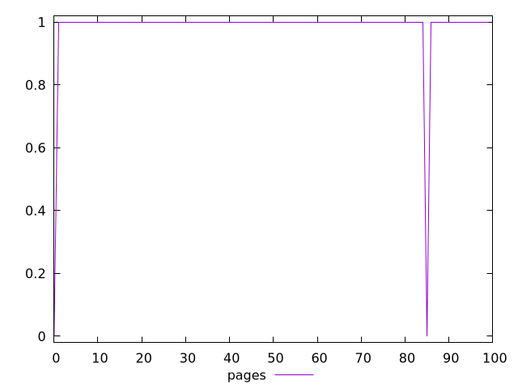
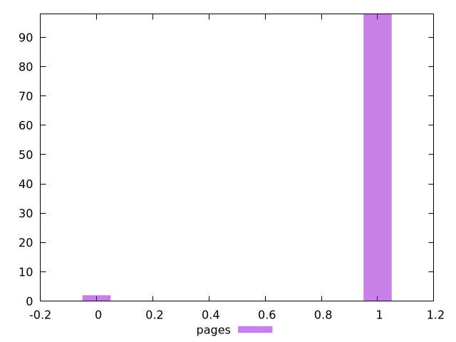
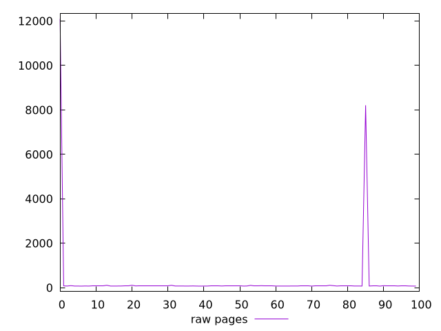
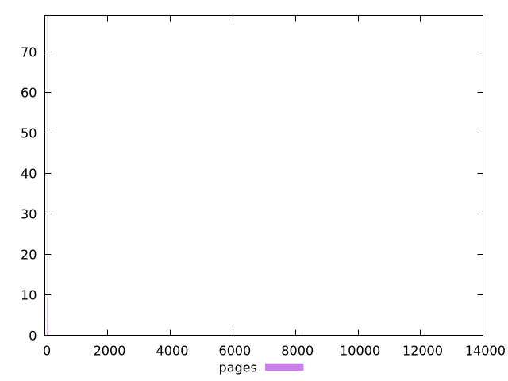

# Report pages

[parent..](./..)  


## Scores

  

## Score Histogram

  

## Score Indicators

```yaml
min: 0
max: 1
range: 1
mean: 0.98
median: 1
stdev: 0.13999999999999987
skewness: -6.857142857142876
eccentricity: 0.285714285714286
quanta: 2
quantaRatio: 0.02
p90range: 0
p90stdev: 1
p90eccentricity: 0.285714285714286
p90quanta: 1
p90quantaRatio: 0.011111111111111112
outlandishness: 0.9603999999999999

```

## Raw Values

  

## Raw Values Histogram

  

## Raw Indicators

```yaml
min: 71.747
max: 12103.054
range: 12031.307
mean: 278.42171999999994
median: 74.189
stdev: 1437.8725156578178
skewness: 7.238430586704251
eccentricity: 0.2852591975529566
quanta: 99
quantaRatio: 0.99
p90range: 39.08399999999999
p90stdev: 74.264
p90eccentricity: 0.2852591975529566
p90quanta: 89
p90quantaRatio: 0.9888888888888889
outlandishness: 13.002249525021993

```

<style>
  img {
    max-width: 80%;
  }
</style>
      
