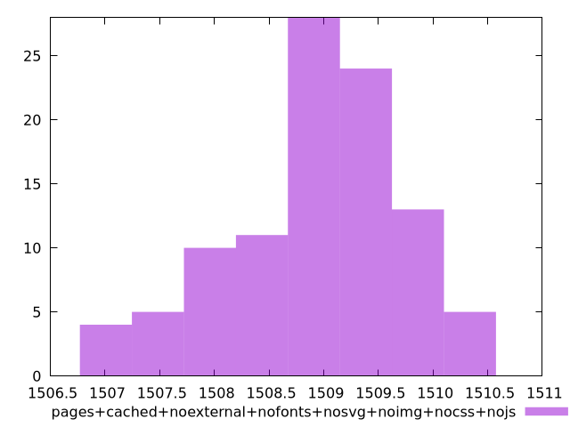

# Report pages+cached+noexternal+nofonts+nosvg+noimg+nocss+nojs

[parent..](./..)  


## Scores

  

## Score Histogram

  

## Score Indicators

```yaml
min: 0.999325687322488
max: 0.9993384100389685
range: 0.00001272271648045109
mean: 0.9993312865508667
median: 0.9993309320206609
stdev: 0.0000028877057732420096
skewness: 0.5555659019244386
eccentricity: 1.5721659263278807
quanta: 99
quantaRatio: 0.99
p90range: 0.000009747023400841215
p90stdev: 0.9993306492087635
p90eccentricity: 1.5721659263278807
p90quanta: 89
p90quantaRatio: 0.9888888888888889
outlandishness: 1.000000853363948

```

## Raw Values

  

## Raw Values Histogram

  

## Raw Indicators

```yaml
min: 1506.9898
max: 1510.459
range: 3.4692000000000007
mean: 1508.9373759999999
median: 1509.0353
stdev: 0.7874440329471022
skewness: -0.5632224666911744
eccentricity: 1.5712913530743395
quanta: 99
quantaRatio: 0.99
p90range: 2.654600000000073
p90stdev: 1509.1122999999998
p90eccentricity: 1.5712913530743395
p90quanta: 89
p90quantaRatio: 0.9888888888888889
outlandishness: 0.9998453754805163

```

<style>
  img {
    max-width: 80%;
  }
</style>
      
