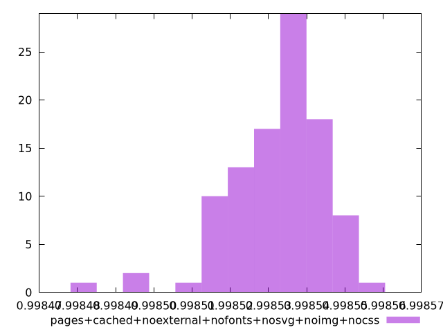
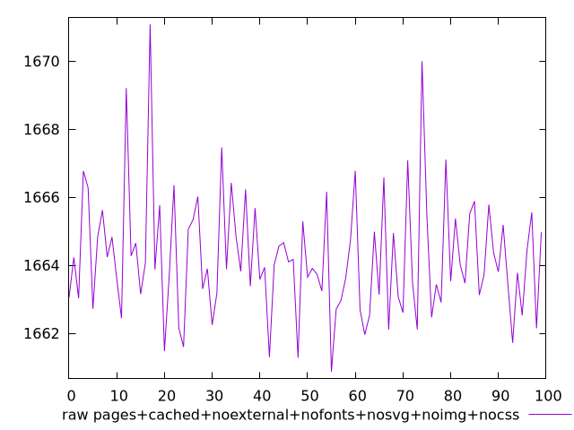
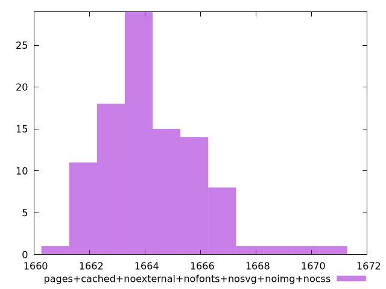

# Report pages+cached+noexternal+nofonts+nosvg+noimg+nocss

[parent..](./..)  


## Scores

  

## Score Histogram

  

## Score Indicators

```yaml
min: 0.9984850227647251
max: 0.9985553351195731
range: 0.00007031235484800114
mean: 0.998532371668431
median: 0.9985347377374654
stdev: 0.000012263878046203009
skewness: -1.0414761226208835
eccentricity: 1.4929446275412819
quanta: 100
quantaRatio: 1
p90range: 0.00003542378016674341
p90stdev: 0.9985348016797331
p90eccentricity: 1.4929446275412819
p90quanta: 90
p90quantaRatio: 1
outlandishness: 0.9999977611073604

```

## Raw Values

  

## Raw Values Histogram

  

## Raw Indicators

```yaml
min: 1660.8732000000005
max: 1671.0765000000001
range: 10.203299999999672
mean: 1664.24167
median: 1663.90175
stdev: 1.7850620844945302
skewness: 1.012918711907463
eccentricity: 1.4963087408558808
quanta: 100
quantaRatio: 1
p90range: 5.1742999999996755
p90stdev: 1663.8923999999997
p90eccentricity: 1.4963087408558808
p90quanta: 90
p90quantaRatio: 1
outlandishness: 1.0001928871761412

```

<style>
  img {
    max-width: 80%;
  }
</style>
      
