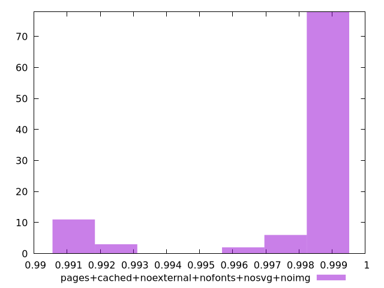
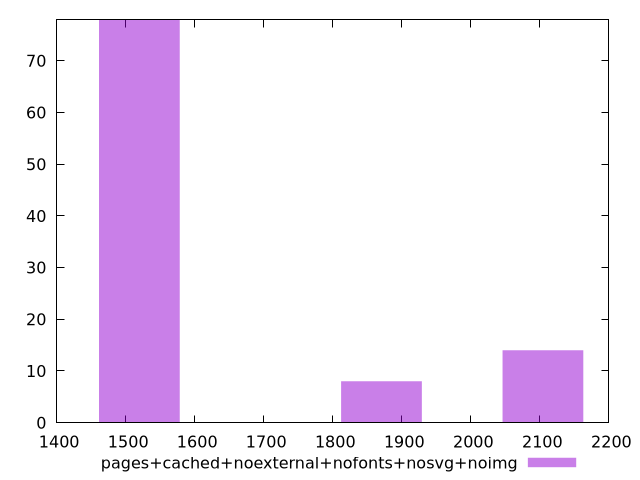

# Report pages+cached+noexternal+nofonts+nosvg+noimg

[parent..](./..)  


## Scores

  

## Score Histogram

  

## Score Indicators

```yaml
min: 0.9916665889753722
max: 0.9993347129089063
range: 0.00766812393353411
mean: 0.9980827148353232
median: 0.9993256849057106
stdev: 0.0026183004890952
skewness: -1.8634263252992125
eccentricity: 0.9515412736685114
quanta: 100
quantaRatio: 1
p90range: 0.007515281799883589
p90stdev: 0.9993261433952689
p90eccentricity: 0.9515412736685114
p90quanta: 90
p90quantaRatio: 1
outlandishness: 0.9985959573601065

```

## Raw Values

  

## Raw Values Histogram

  

## Raw Indicators

```yaml
min: 1508.0034
max: 2123.4029499999997
range: 615.3995499999996
mean: 1621.093204
median: 1510.4596500000002
stdev: 218.78200753317773
skewness: 1.619172145674017
eccentricity: 1.0181548954212776
quanta: 100
quantaRatio: 1
p90range: 609.36355
p90stdev: 1510.33555
p90eccentricity: 1.0181548954212776
p90quanta: 90
p90quantaRatio: 1
outlandishness: 1.071963143267155

```

<style>
  img {
    max-width: 80%;
  }
</style>
      
