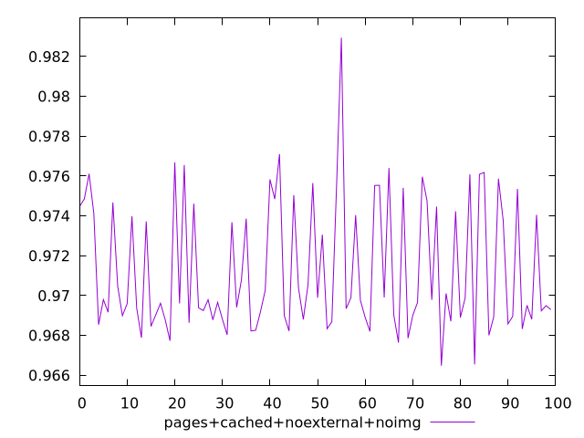
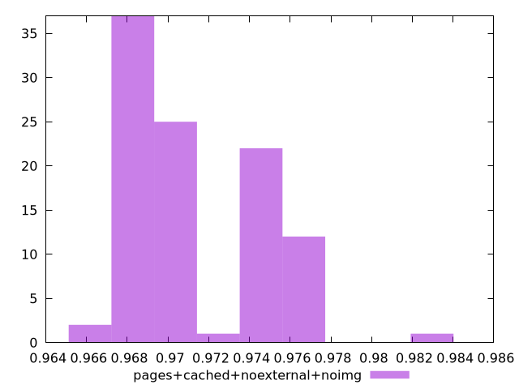
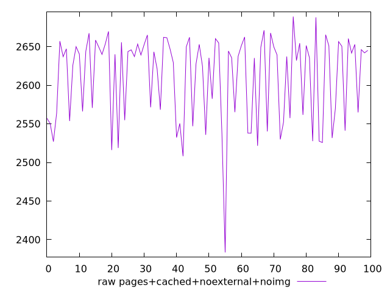
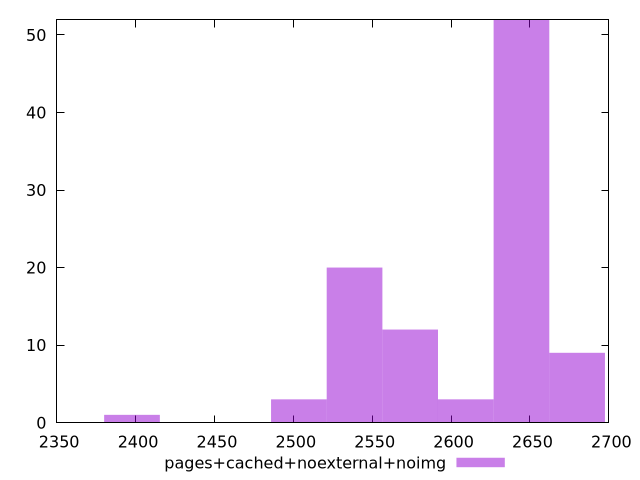

# Report pages+cached+noexternal+noimg

[parent..](./..)  


## Scores

  

## Score Histogram

  

## Score Indicators

```yaml
min: 0.9664787269267197
max: 0.9829424472323747
range: 0.016463720305655016
mean: 0.9712922955256336
median: 0.9697123085301627
stdev: 0.003238131898060374
skewness: 0.8330946061469531
eccentricity: 1.5779312758957573
quanta: 100
quantaRatio: 1
p90range: 0.009417211333706543
p90stdev: 0.9695998640911208
p90eccentricity: 1.5779312758957573
p90quanta: 90
p90quantaRatio: 1
outlandishness: 1.0010923535556158

```

## Raw Values

  

## Raw Values Histogram

  

## Raw Indicators

```yaml
min: 2383.476745090407
max: 2688.970618200059
range: 305.4938731096522
mean: 2610.3615840784
median: 2638.443139300719
stdev: 56.34046540779391
skewness: -1.0194706506682174
eccentricity: 1.5471563261949355
quanta: 100
quantaRatio: 1
p90range: 157.2963109035627
p90stdev: 2641.047157712502
p90eccentricity: 1.5471563261949355
p90quanta: 90
p90quantaRatio: 1
outlandishness: 0.9913903122971842

```

<style>
  img {
    max-width: 80%;
  }
</style>
      
