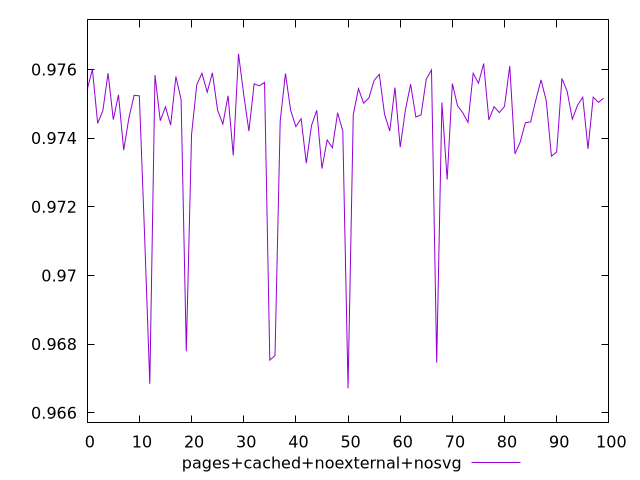
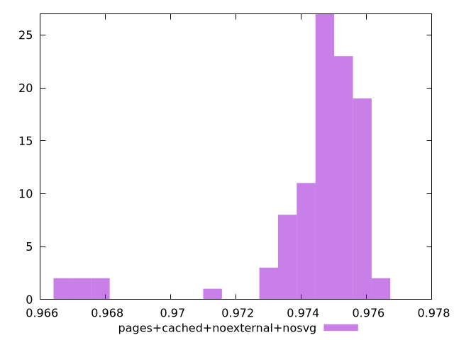
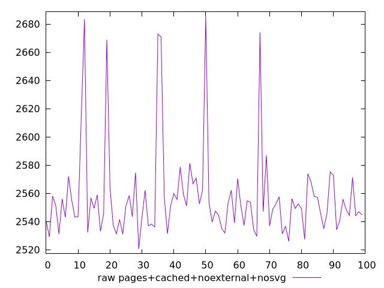
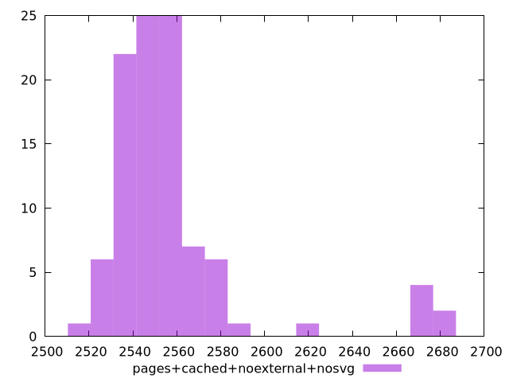

# Report pages+cached+noexternal+nosvg

[parent..](./..)  


## Scores

  

## Score Histogram

  

## Score Indicators

```yaml
min: 0.9667126651959529
max: 0.9764535418014721
range: 0.009740876605519255
mean: 0.9744030286284058
median: 0.9748144129591982
stdev: 0.0019700804706673076
skewness: -2.747953577487221
eccentricity: 1.080218119778028
quanta: 100
quantaRatio: 1
p90range: 0.0032125086572860617
p90stdev: 0.97491108765462
p90eccentricity: 1.080218119778028
p90quanta: 90
p90quantaRatio: 1
outlandishness: 0.999085165089927

```

## Raw Values

  

## Raw Values Histogram

  

## Raw Indicators

```yaml
min: 2520.577060921106
max: 2685.4222802932204
range: 164.84521937211457
mean: 2557.734112243319
median: 2551.0872664077638
stdev: 33.39576063793905
skewness: 2.621867425947453
eccentricity: 1.1181652511417708
quanta: 100
quantaRatio: 1
p90range: 57.90866807243401
p90stdev: 2549.3247934196843
p90eccentricity: 1.1181652511417708
p90quanta: 90
p90quantaRatio: 1
outlandishness: 1.0058161240674361

```

<style>
  img {
    max-width: 80%;
  }
</style>
      
