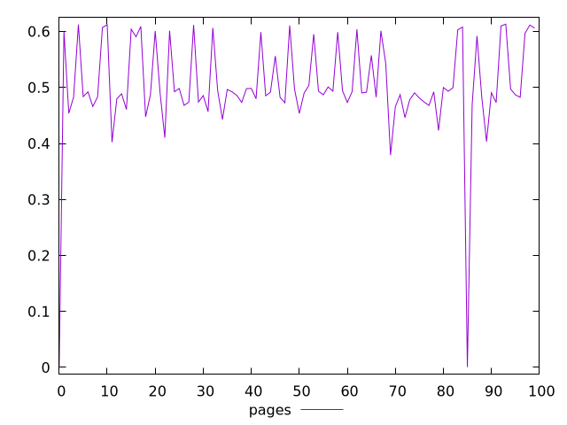
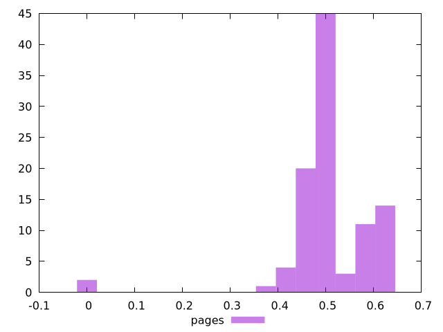
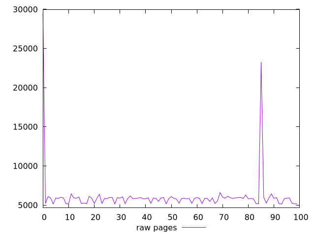
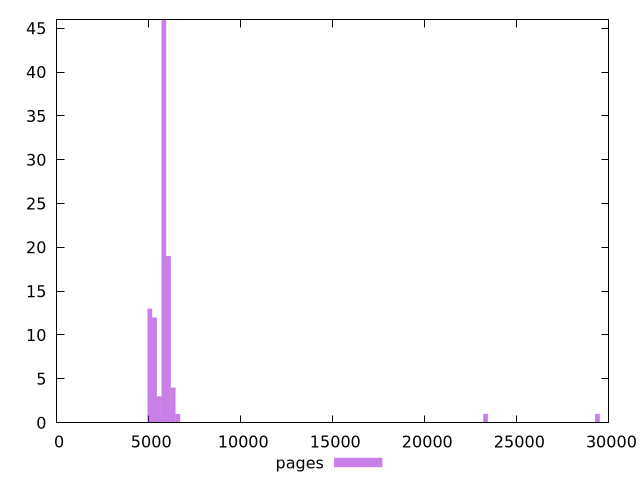

# Report pages

[parent..](./..)  


## Scores

  

## Score Histogram

  

## Score Indicators

```yaml
min: 0.00005371378454288589
max: 0.6131500724251653
range: 0.6130963586406224
mean: 0.5014010779580093
median: 0.4912106122762273
stdev: 0.09277193623211383
skewness: -2.8826923053239444
eccentricity: 1.1189417411725078
quanta: 100
quantaRatio: 1
p90range: 0.2067884442974609
p90stdev: 0.49056031423758734
p90eccentricity: 1.1189417411725078
p90quanta: 90
p90quantaRatio: 1
outlandishness: 0.984536676426715

```

## Raw Values

  

## Raw Values Histogram

  

## Raw Indicators

```yaml
min: 5140.588087448371
max: 29476.904781177953
range: 24336.316693729583
mean: 6151.918920244366
median: 5853.888977425509
stdev: 2942.789299776087
skewness: 6.935249603832598
eccentricity: 0.45070745517047067
quanta: 100
quantaRatio: 1
p90range: 1429.7580645216885
p90stdev: 5859.165151134612
p90eccentricity: 0.45070745517047067
p90quanta: 90
p90quantaRatio: 1
outlandishness: 1.1282897076317553

```

<style>
  img {
    max-width: 80%;
  }
</style>
      
