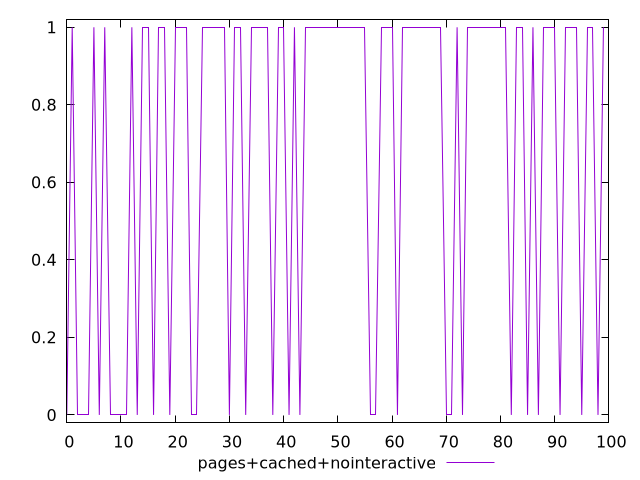
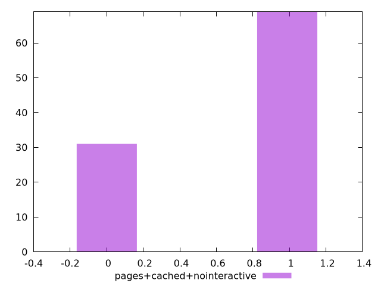

# Report pages+cached+nointeractive

[parent..](./..)  


## Scores

  

## Score Histogram

  

## Score Indicators

```yaml
min: 0
max: 1
range: 1
mean: 0.69
median: 1
stdev: 0.4624932431938869
skewness: -0.8216336251223822
eccentricity: 1.340560125199673
quanta: 2
quantaRatio: 0.02
p90range: 1
p90stdev: 1
p90eccentricity: 1.340560125199673
p90quanta: 2
p90quantaRatio: 0.022222222222222223
outlandishness: 0.8099999999999998

```

## Raw Values

  

## Raw Values Histogram

  

## Raw Indicators

```yaml
{}

```

<style>
  img {
    max-width: 80%;
  }
</style>
      
