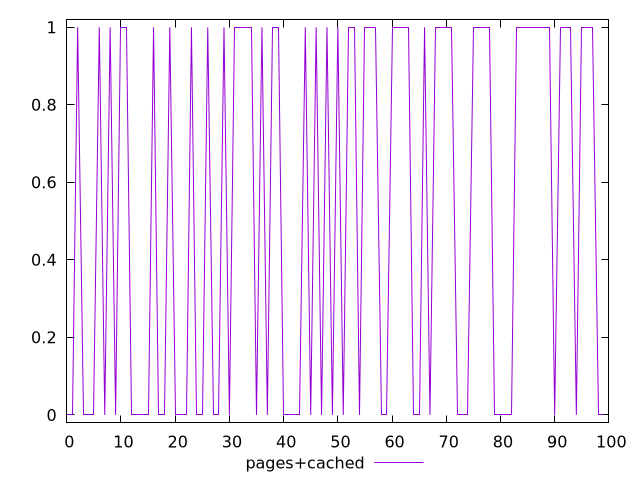
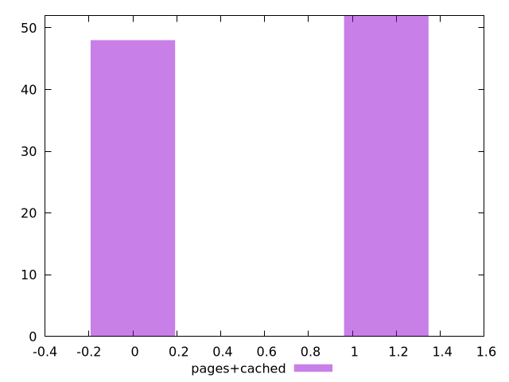

# Report pages+cached

[parent..](./..)  


## Scores

  

## Score Histogram

  

## Score Indicators

```yaml
min: 0
max: 1
range: 1
mean: 0.52
median: 1
stdev: 0.4995998398718715
skewness: -0.08006407690254419
eccentricity: 1.921537845661047
quanta: 2
quantaRatio: 0.02
p90range: 1
p90stdev: 1
p90eccentricity: 1.921537845661047
p90quanta: 2
p90quantaRatio: 0.022222222222222223
outlandishness: 0.8100000000000003

```

## Raw Values

  

## Raw Values Histogram

  

## Raw Indicators

```yaml
{}

```

<style>
  img {
    max-width: 80%;
  }
</style>
      
