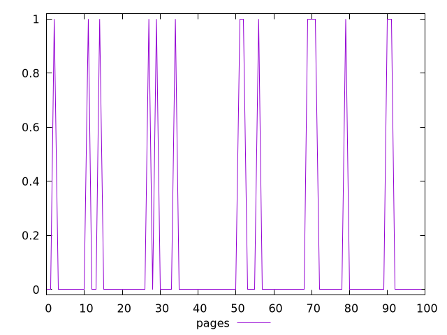
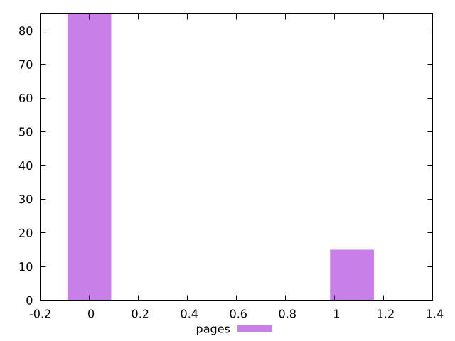

# Report pages

[parent..](./..)  


## Scores

  

## Score Histogram

  

## Score Indicators

```yaml
min: 0
max: 1
range: 1
mean: 0.15
median: 0
stdev: 0.3570714214271428
skewness: 1.960392117639209
eccentricity: 0.8401680504168035
quanta: 2
quantaRatio: 0.02
p90range: 1
p90stdev: 0
p90eccentricity: 0.8401680504168035
p90quanta: 2
p90quantaRatio: 0.022222222222222223
outlandishness: 7.290000000000001

```

## Raw Values

  

## Raw Values Histogram

  

## Raw Indicators

```yaml
{}

```

<style>
  img {
    max-width: 80%;
  }
</style>
      
