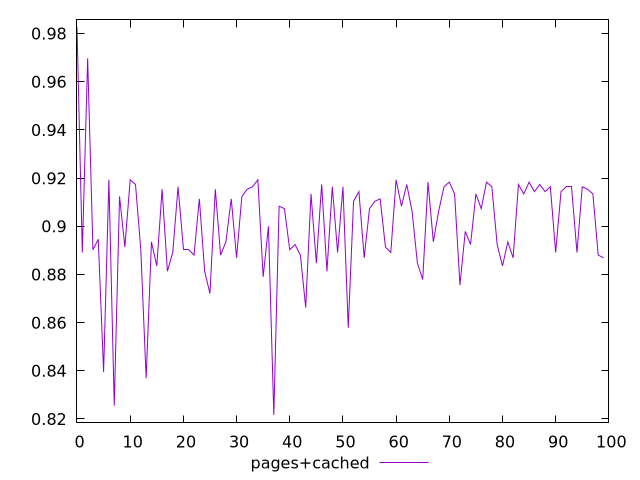

# Report pages+cached

[parent..](./..)  


## Scores

  

## Score Histogram

  

## Score Indicators

```yaml
min: 0.821695891391382
max: 0.9826442363466058
range: 0.1609483449552238
mean: 0.9001712077916784
median: 0.9068090621917708
stdev: 0.022860210531689962
skewness: -0.46036656280135735
eccentricity: 1.4879322563673676
quanta: 75
quantaRatio: 0.75
p90range: 0.04144505191122205
p90stdev: 0.9078390563308558
p90eccentricity: 1.4879322563673676
p90quanta: 65
p90quantaRatio: 0.7222222222222222
outlandishness: 0.9937612678902115

```

## Raw Values

  

## Raw Values Histogram

  

## Raw Indicators

```yaml
min: 178
max: 352.99999999999727
range: 174.99999999999727
mean: 285.6973649999995
median: 280.49999999999955
stdev: 22.676446952273462
skewness: -0.7104894872310542
eccentricity: 1.4378473871424122
quanta: 75
quantaRatio: 0.75
p90range: 39.00000000000182
p90stdev: 279.5
p90eccentricity: 1.4378473871424122
p90quanta: 65
p90quantaRatio: 0.7222222222222222
outlandishness: 1.0133364902699085

```

<style>
  img {
    max-width: 80%;
  }
</style>
      
