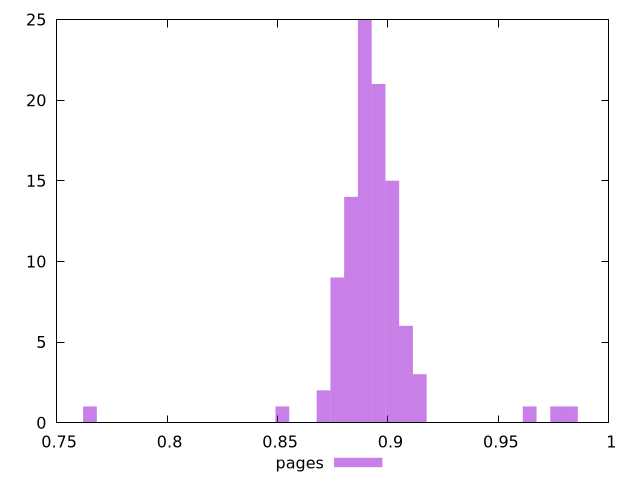

# Report pages

[parent..](./..)  


## Scores

  

## Score Histogram

  

## Score Indicators

```yaml
min: 0.7675770589246068
max: 0.9826442363466058
range: 0.215067177421999
mean: 0.8928613535321034
median: 0.8924519953997028
stdev: 0.02134601851471845
skewness: -0.42921728273098686
eccentricity: 1.04663697940642
quanta: 58
quantaRatio: 0.58
p90range: 0.03173992780237378
p90stdev: 0.8919041263607848
p90eccentricity: 1.04663697940642
p90quanta: 48
p90quantaRatio: 0.5333333333333333
outlandishness: 1.0022627072690933

```

## Raw Values

  

## Raw Values Histogram

  

## Raw Indicators

```yaml
min: 178
max: 393.9999999999982
range: 215.99999999999818
mean: 292.5920149999999
median: 294
stdev: 21.896780606798597
skewness: -1.7581432333485347
eccentricity: 0.9853489600795923
quanta: 58
quantaRatio: 0.58
p90range: 29
p90stdev: 294.4999999999991
p90eccentricity: 0.9853489600795923
p90quanta: 48
p90quantaRatio: 0.5333333333333333
outlandishness: 0.9874634496395271

```

<style>
  img {
    max-width: 80%;
  }
</style>
      
