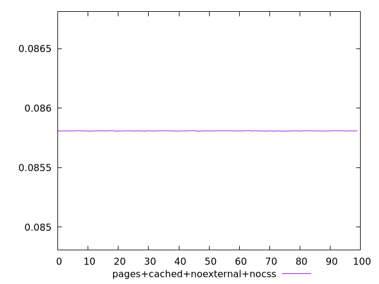
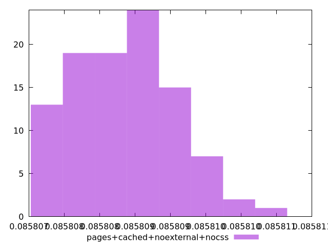
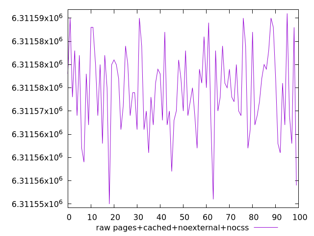
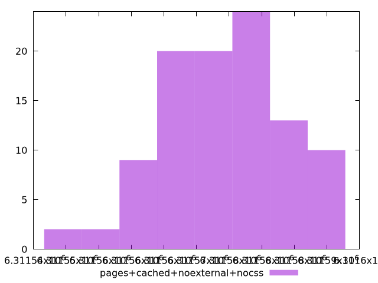

# Report pages+cached+noexternal+nocss

[parent..](./..)  


## Scores

  

## Score Histogram

  

## Score Indicators

```yaml
min: 0.0858075516366752
max: 0.08581077032782103
range: 0.000003218691145834285
mean: 0.0858088571585363
median: 0.0858088076980294
stdev: 7.148353348496486e-7
skewness: 0.24229605899226986
eccentricity: 1.6451289343620137
quanta: 33
quantaRatio: 0.33
p90range: 0.0000021981221977607213
p90stdev: 0.0858088076980294
p90eccentricity: 1.6451289343620137
p90quanta: 26
p90quantaRatio: 0.28888888888888886
outlandishness: 1.0000004411949368

```

## Raw Values

  

## Raw Values Histogram

  

## Raw Indicators

```yaml
min: 6311550
max: 6311591
range: 41
mean: 6311574.37
median: 6311575
stdev: 9.10566307305513
skewness: -0.24227727378405242
eccentricity: 1.6451300559071687
quanta: 33
quantaRatio: 0.33
p90range: 28
p90stdev: 6311575
p90eccentricity: 1.6451300559071687
p90quanta: 26
p90quantaRatio: 0.28888888888888886
outlandishness: 0.999999923597162

```

<style>
  img {
    max-width: 80%;
  }
</style>
      
