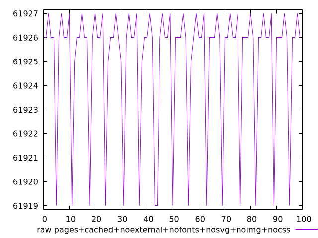
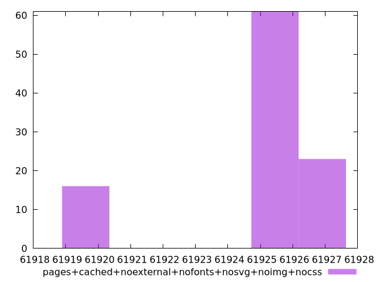

# Report pages+cached+noexternal+nofonts+nosvg+noimg+nocss

[parent..](./..)  


## Scores

  

## Score Histogram

  

## Score Indicators

```yaml
min: 1
max: 1
range: 0
mean: 1
median: 1
stdev: 0
skewness: .nan
eccentricity: .nan
quanta: 1
quantaRatio: 0.01
p90range: 0
p90stdev: 1
p90eccentricity: .nan
p90quanta: 1
p90quantaRatio: 0.011111111111111112
outlandishness: 1

```

## Raw Values

  

## Raw Values Histogram

  

## Raw Indicators

```yaml
min: 61919
max: 61927
range: 8
mean: 61925.06
median: 61926
stdev: 2.6900557615038365
skewness: -1.7190084637407796
eccentricity: 1.0408706169088227
quanta: 4
quantaRatio: 0.04
p90range: 8
p90stdev: 61926
p90eccentricity: 1.0408706169088227
p90quanta: 4
p90quantaRatio: 0.044444444444444446
outlandishness: 0.9999782536391114

```

<style>
  img {
    max-width: 80%;
  }
</style>
      
