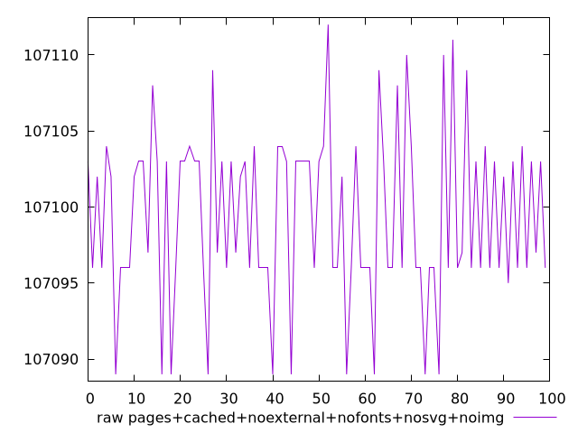
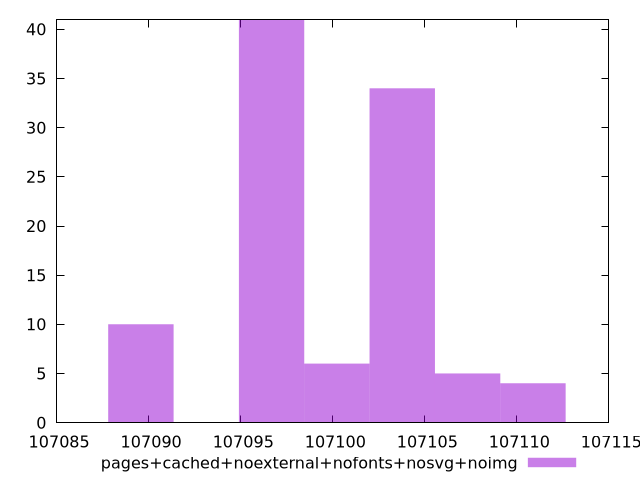

# Report pages+cached+noexternal+nofonts+nosvg+noimg

[parent..](./..)  


## Scores

  

## Score Histogram

  

## Score Indicators

```yaml
min: 1
max: 1
range: 0
mean: 1
median: 1
stdev: 0
skewness: .nan
eccentricity: .nan
quanta: 1
quantaRatio: 0.01
p90range: 0
p90stdev: 1
p90eccentricity: .nan
p90quanta: 1
p90quantaRatio: 0.011111111111111112
outlandishness: 1

```

## Raw Values

  

## Raw Values Histogram

  

## Raw Indicators

```yaml
min: 107089
max: 107112
range: 23
mean: 107099.4
median: 107097
stdev: 5.513619500836087
skewness: -0.04238308618747035
eccentricity: 1.7193787127599895
quanta: 12
quantaRatio: 0.12
p90range: 20
p90stdev: 107099.5
p90eccentricity: 1.7193787127599895
p90quanta: 9
p90quantaRatio: 0.1
outlandishness: 0.9999964726527099

```

<style>
  img {
    max-width: 80%;
  }
</style>
      
