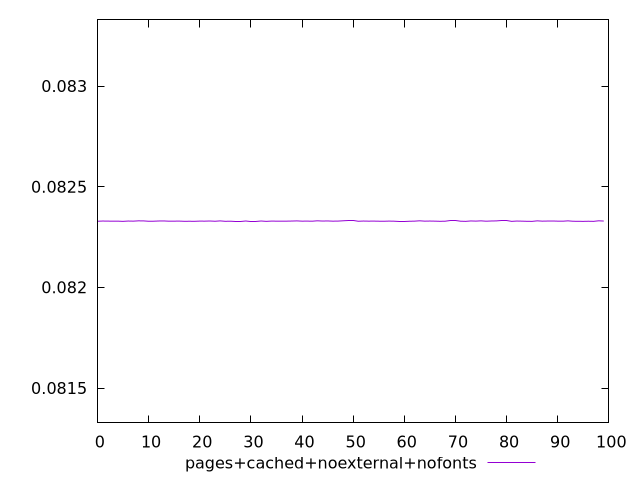
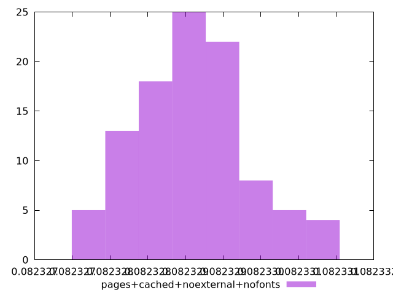
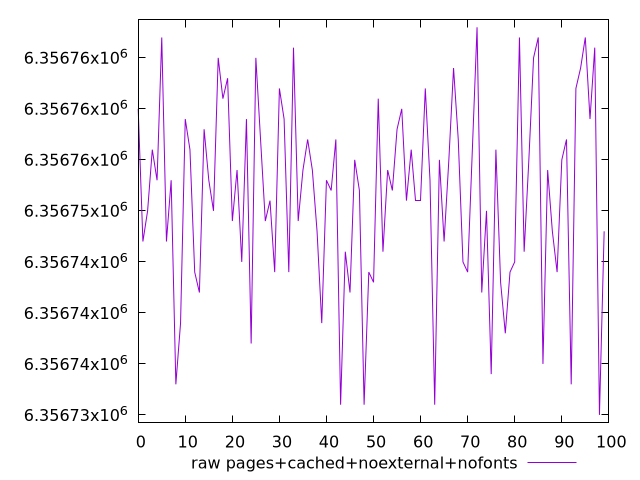
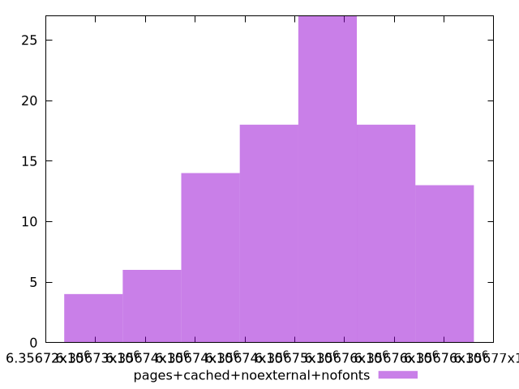

# Report pages+cached+noexternal+nofonts

[parent..](./..)  


## Scores

  

## Score Histogram

  

## Score Indicators

```yaml
min: 0.08232784618598887
max: 0.08233071751475185
range: 0.000002871328762976688
mean: 0.08232908916055842
median: 0.08232897959417856
stdev: 7.091794370585874e-7
skewness: 0.35113014994544317
eccentricity: 1.6131262498754009
quanta: 35
quantaRatio: 0.35
p90range: 0.0000022668327270825017
p90stdev: 0.08232897959417856
p90eccentricity: 1.6131262498754009
p90quanta: 29
p90quantaRatio: 0.32222222222222224
outlandishness: 1.0000024984658564

```

## Raw Values

  

## Raw Values Histogram

  

## Raw Indicators

```yaml
min: 6356730
max: 6356768
range: 38
mean: 6356751.55
median: 6356753
stdev: 9.385494126576392
skewness: -0.3511129192351117
eccentricity: 1.6131276409617696
quanta: 35
quantaRatio: 0.35
p90range: 30
p90stdev: 6356753
p90eccentricity: 1.6131276409617696
p90quanta: 29
p90quantaRatio: 0.32222222222222224
outlandishness: 0.9999995717590461

```

<style>
  img {
    max-width: 80%;
  }
</style>
      
