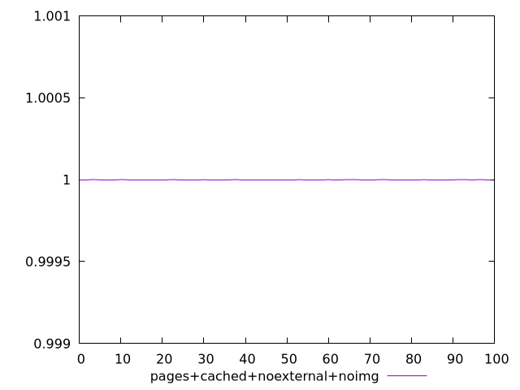
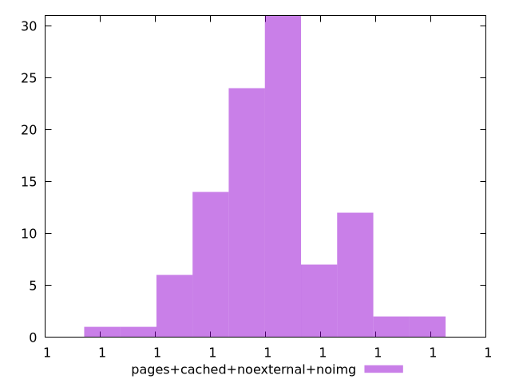
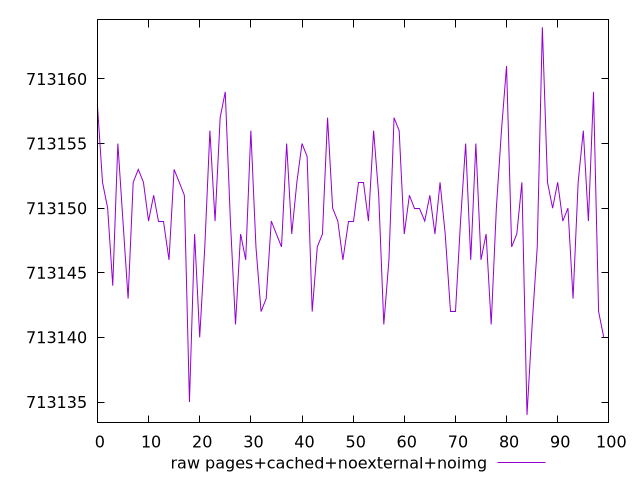
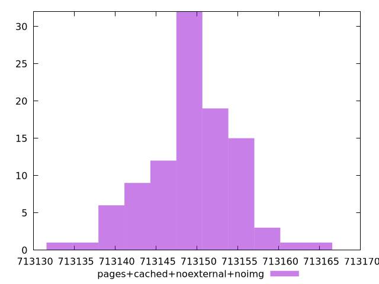

# Report pages+cached+noexternal+noimg

[parent..](./..)  


## Scores

  

## Score Histogram

  

## Score Indicators

```yaml
min: 0.9999999836500553
max: 0.9999999836624358
range: 1.238054103680497e-11
mean: 0.9999999836560776
median: 0.9999999836562466
stdev: 2.1822269618198503e-12
skewness: 0.17840751158478846
eccentricity: 1.493608028842581
quanta: 23
quantaRatio: 0.23
p90range: 6.602940416655656e-12
p90stdev: 0.9999999836562466
p90eccentricity: 1.493608028842581
p90quanta: 16
p90quantaRatio: 0.17777777777777778
outlandishness: 1.0000000000000302

```

## Raw Values

  

## Raw Values Histogram

  

## Raw Indicators

```yaml
min: 713134
max: 713164
range: 30
mean: 713149.41
median: 713149
stdev: 5.2879012850090135
skewness: -0.17917015933923952
eccentricity: 1.493976451946912
quanta: 23
quantaRatio: 0.23
p90range: 16
p90stdev: 713149
p90eccentricity: 1.493976451946912
p90quanta: 16
p90quantaRatio: 0.17777777777777778
outlandishness: 0.9999999034018917

```

<style>
  img {
    max-width: 80%;
  }
</style>
      
