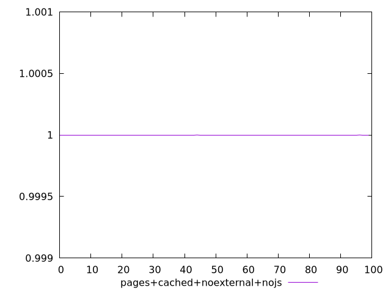
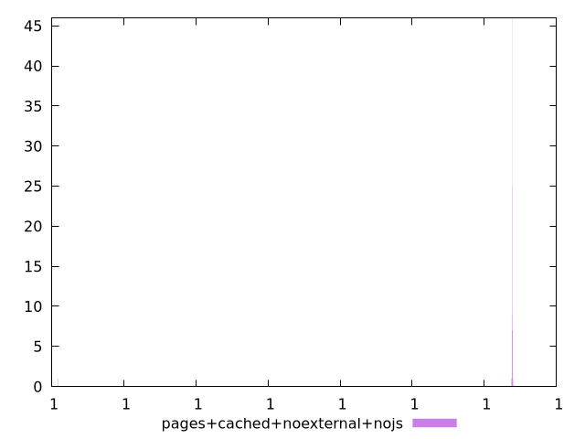
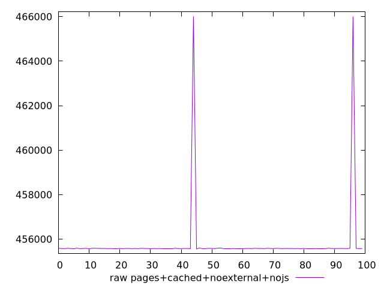
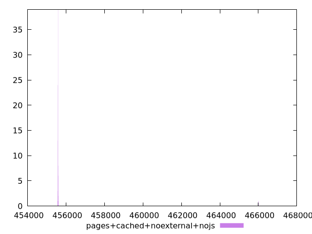

# Report pages+cached+noexternal+nojs

[parent..](./..)  


## Scores

  

## Score Histogram

  

## Score Indicators

```yaml
min: 0.9999999999968165
max: 0.9999999999980791
range: 1.262545623603728e-12
mean: 0.999999999998053
median: 0.9999999999980771
stdev: 1.764349147162589e-13
skewness: -6.873589654308232
eccentricity: 0.2875707007382008
quanta: 19
quantaRatio: 0.19
p90range: 3.3306690738754696e-15
p90stdev: 0.9999999999980771
p90eccentricity: 0.2875707007382008
p90quanta: 14
p90quantaRatio: 0.15555555555555556
outlandishness: 0.9999999999999512

```

## Raw Values

  

## Raw Values Histogram

  

## Raw Indicators

```yaml
min: 455561
max: 466013
range: 10452
mean: 455790.13
median: 455583
stdev: 1460.068756291977
skewness: 6.856910806359532
eccentricity: 0.29249307483612536
quanta: 24
quantaRatio: 0.24
p90range: 34
p90stdev: 455583
p90eccentricity: 0.29249307483612536
p90quanta: 17
p90quantaRatio: 0.18888888888888888
outlandishness: 1.0009110654479816

```

<style>
  img {
    max-width: 80%;
  }
</style>
      
