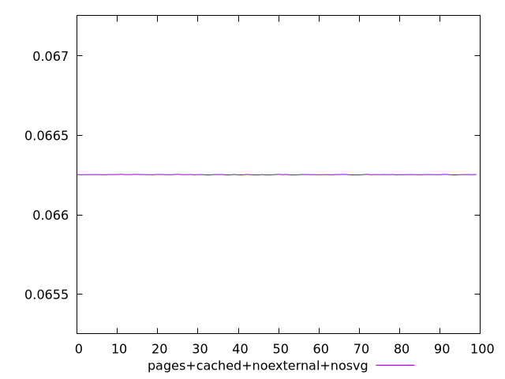
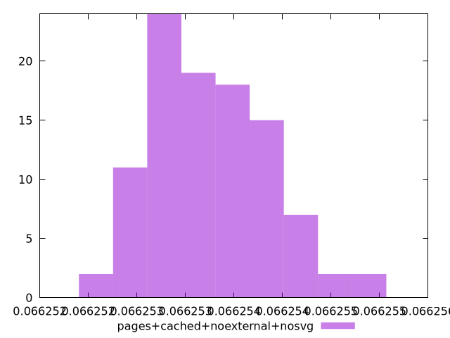
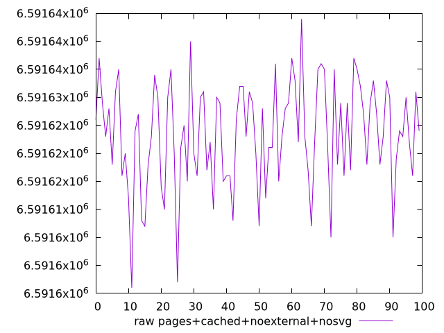
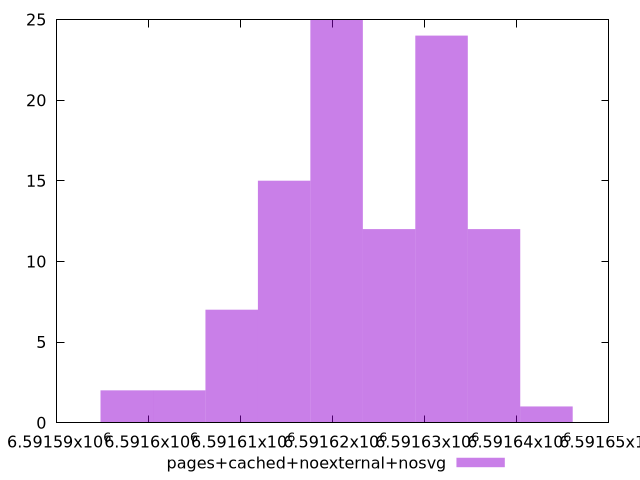

# Report pages+cached+noexternal+nosvg

[parent..](./..)  


## Scores

  

## Score Histogram

  

## Score Indicators

```yaml
min: 0.0662525056247587
max: 0.06625546840673463
range: 0.0000029627819759237006
mean: 0.06625377775643898
median: 0.06625380182659246
stdev: 5.804010015410259e-7
skewness: 0.49600213689975464
eccentricity: 1.618616506038326
quanta: 33
quantaRatio: 0.33
p90range: 0.0000017900102025070197
p90stdev: 0.06625374010215668
p90eccentricity: 1.618616506038326
p90quanta: 27
p90quantaRatio: 0.3
outlandishness: 1.000002440919221

```

## Raw Values

  

## Raw Values Histogram

  

## Raw Indicators

```yaml
min: 6591596
max: 6591644
range: 48
mean: 6591623.39
median: 6591623
stdev: 9.403079282873243
skewness: -0.49598027682669965
eccentricity: 1.6186187037113395
quanta: 33
quantaRatio: 0.33
p90range: 29
p90stdev: 6591624
p90eccentricity: 1.6186187037113395
p90quanta: 27
p90quantaRatio: 0.3
outlandishness: 0.9999996025259539

```

<style>
  img {
    max-width: 80%;
  }
</style>
      
