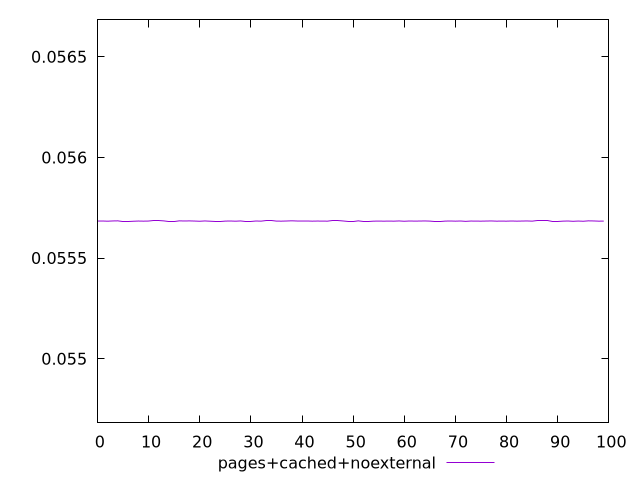
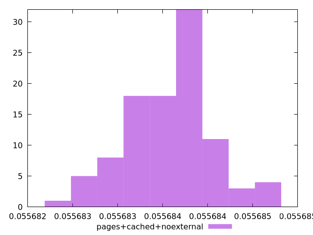
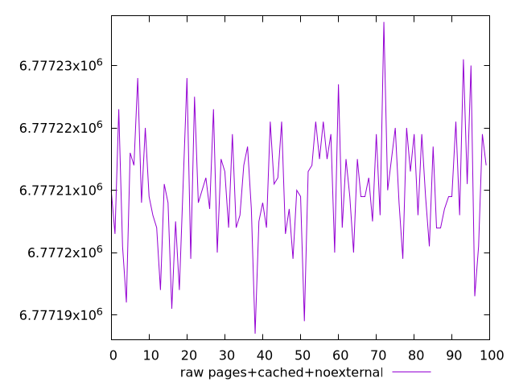
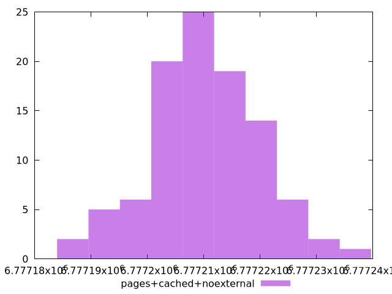

# Report pages+cached+noexternal

[parent..](./..)  


## Scores

  

## Score Histogram

  

## Score Indicators

```yaml
min: 0.05568269320705577
max: 0.05568531346121225
range: 0.000002620254156482371
mean: 0.055684084549533316
median: 0.05568413433241373
stdev: 4.905622114109563e-7
skewness: -0.07365715114562288
eccentricity: 1.5532603571458818
quanta: 34
quantaRatio: 0.34
p90range: 0.0000017293700526055389
p90stdev: 0.05568413433241373
p90eccentricity: 1.5532603571458818
p90quanta: 25
p90quantaRatio: 0.2777777777777778
outlandishness: 0.9999999686600409

```

## Raw Values

  

## Raw Values Histogram

  

## Raw Indicators

```yaml
min: 6777187
max: 6777237
range: 50
mean: 6777210.45
median: 6777209.5
stdev: 9.360956147744737
skewness: 0.07368454355228914
eccentricity: 1.5532601339597405
quanta: 34
quantaRatio: 0.34
p90range: 33
p90stdev: 6777209.5
p90eccentricity: 1.5532601339597405
p90quanta: 25
p90quantaRatio: 0.2777777777777778
outlandishness: 1.0000000049184443

```

<style>
  img {
    max-width: 80%;
  }
</style>
      
