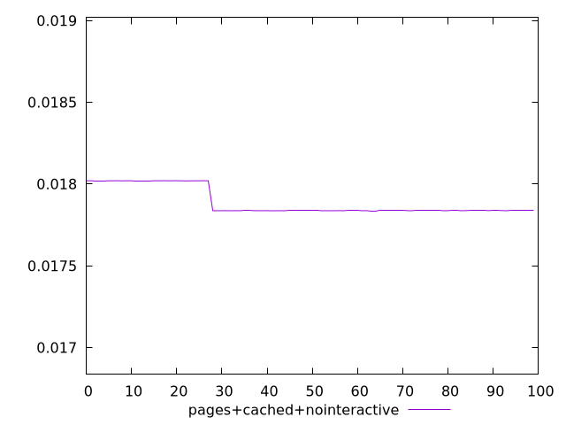
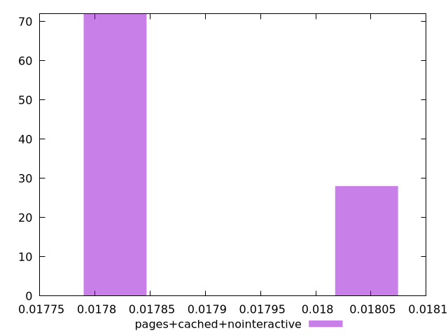
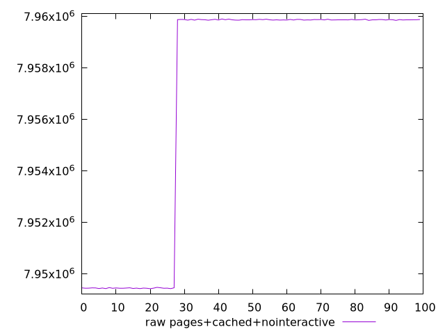
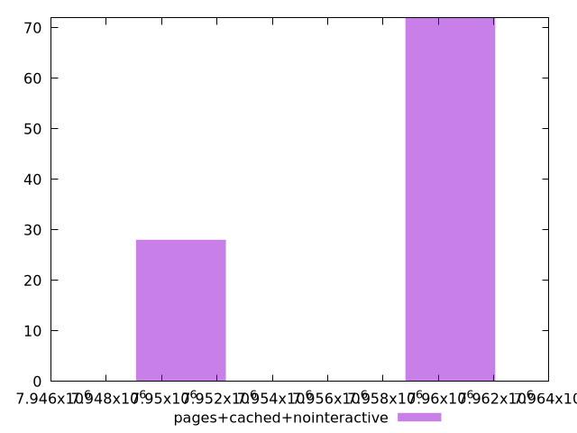

# Report pages+cached+nointeractive

[parent..](./..)  


## Scores

  

## Score Histogram

  

## Score Indicators

```yaml
min: 0.01783648779851399
max: 0.01802027229989761
range: 0.00018378450138362146
mean: 0.017888215054424474
median: 0.01783713334743764
stdev: 0.00008210868767607336
skewness: 0.9799491210597384
eccentricity: 1.249762381298516
quanta: 62
quantaRatio: 0.62
p90range: 0.0001834496606497038
p90stdev: 0.017837089728546918
p90eccentricity: 1.249762381298516
p90quanta: 54
p90quantaRatio: 0.6
outlandishness: 1.0016404382624684

```

## Raw Values

  

## Raw Values Histogram

  

## Raw Indicators

```yaml
min: 7949427
max: 7959908
range: 10481
mean: 7956957.92
median: 7959871
stdev: 4682.538291738788
skewness: -0.9799489025868553
eccentricity: 1.249775150867377
quanta: 62
quantaRatio: 0.62
p90range: 10462
p90stdev: 7959873.5
p90eccentricity: 1.249775150867377
p90quanta: 54
p90quantaRatio: 0.6
outlandishness: 0.999789977378028

```

<style>
  img {
    max-width: 80%;
  }
</style>
      
