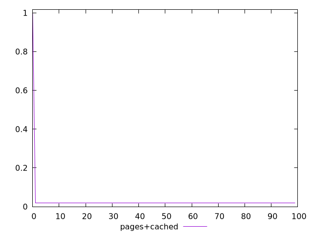
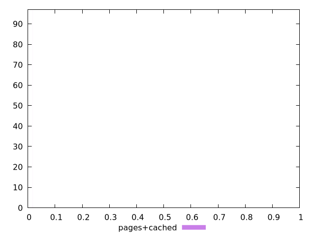
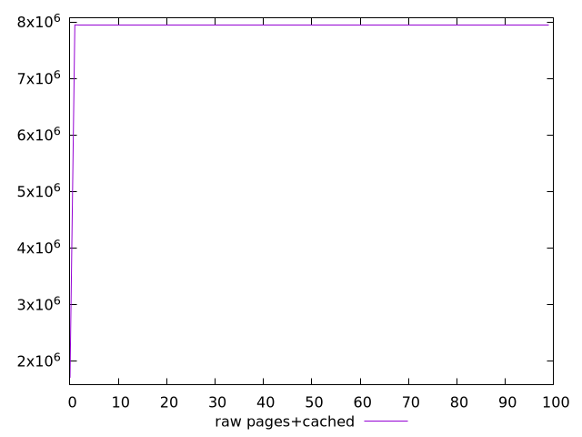
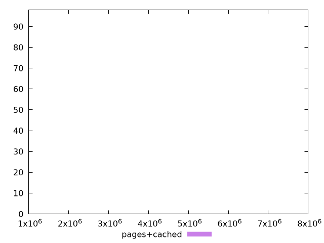

# Report pages+cached

[parent..](./..)  


## Scores

  

## Score Histogram

  

## Score Indicators

```yaml
min: 0.018019479265947214
max: 0.9972440853759366
range: 0.9792246061099894
mean: 0.027812390244904794
median: 0.018019866967155518
stdev: 0.09743155132597241
skewness: 9.849370578950833
eccentricity: 0.20101644449684425
quanta: 48
quantaRatio: 0.48
p90range: 0.0000261178448746624
p90stdev: 0.01801989340162899
p90eccentricity: 0.20101644449684425
p90quanta: 40
p90quantaRatio: 0.4444444444444444
outlandishness: 2.382082816313578

```

## Raw Values

  

## Raw Values Histogram

  

## Raw Indicators

```yaml
min: 1702593
max: 7949472
range: 6246879
mean: 7886965.49
median: 7949450
stdev: 621552.8388576066
skewness: -9.849369752991308
eccentricity: 0.20108652424421436
quanta: 48
quantaRatio: 0.48
p90range: 1481
p90stdev: 7949448.5
p90eccentricity: 0.20108652424421436
p90quanta: 40
p90quantaRatio: 0.4444444444444444
outlandishness: 0.984346162263662

```

<style>
  img {
    max-width: 80%;
  }
</style>
      
