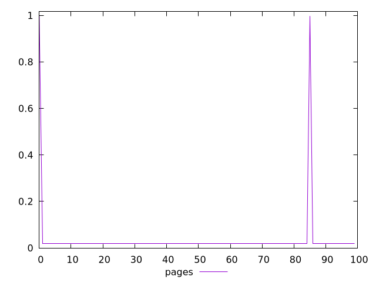
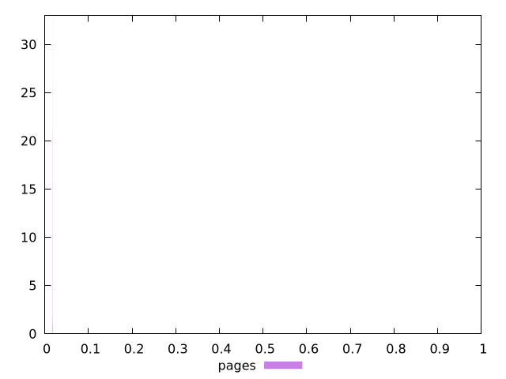
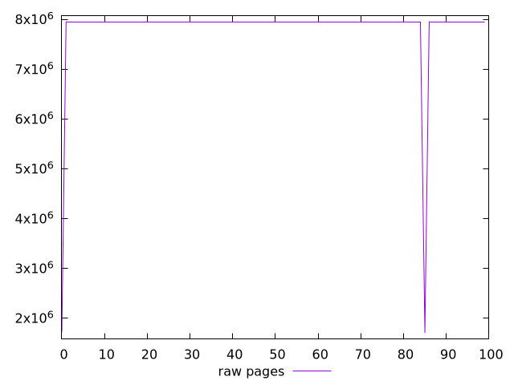
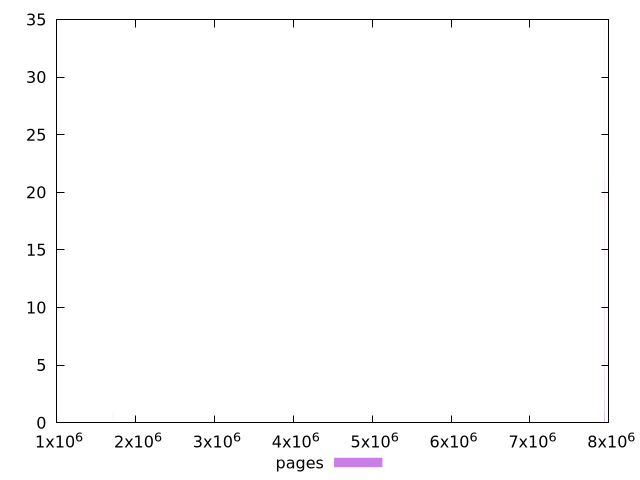

# Report pages

[parent..](./..)  


## Scores

  

## Score Histogram

  

## Score Indicators

```yaml
min: 0.01803139600571907
max: 0.9972066961239933
range: 0.9791753001182741
mean: 0.037625515997039505
median: 0.018045605709144957
stdev: 0.13706254156159753
skewness: 6.857143088913513
eccentricity: 0.28572669971775244
quanta: 37
quantaRatio: 0.37
p90range: 0.000001605956179928647
p90stdev: 0.018045649828312194
p90eccentricity: 0.28572669971775244
p90quanta: 29
p90quantaRatio: 0.32222222222222224
outlandishness: 4.347304459620331

```

## Raw Values

  

## Raw Values Histogram

  

## Raw Indicators

```yaml
min: 1704956
max: 7948796
range: 6243840
mean: 7823328.27
median: 7947990.5
stdev: 872816.0508567983
skewness: -6.857163760585552
eccentricity: 0.2858245099355194
quanta: 37
quantaRatio: 0.37
p90range: 91
p90stdev: 7947988
p90eccentricity: 0.2858245099355194
p90quanta: 29
p90quantaRatio: 0.32222222222222224
outlandishness: 0.96887707288978

```

<style>
  img {
    max-width: 80%;
  }
</style>
      
