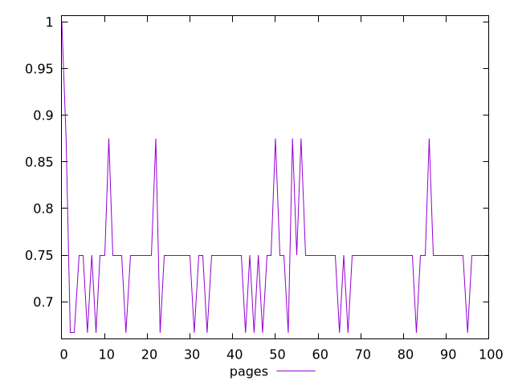
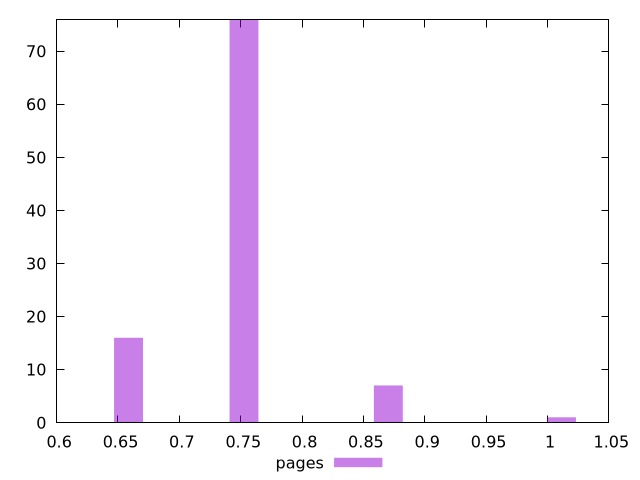
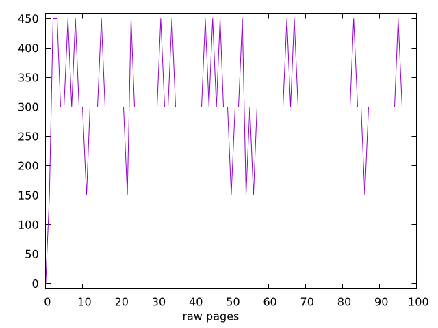
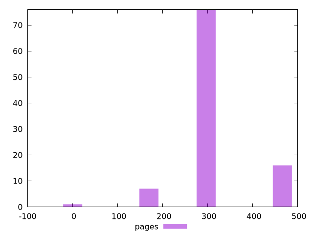

# Report pages

[parent..](./..)  


## Scores

  

## Score Histogram

  

## Score Indicators

```yaml
min: 0.6666666666666666
max: 1
range: 0.33333333333333337
mean: 0.7479166666666667
median: 0.75
stdev: 0.053155628425721135
skewness: 1.451769852954009
eccentricity: 0.9249569259701538
quanta: 4
quantaRatio: 0.04
p90range: 0.08333333333333337
p90stdev: 0.75
p90eccentricity: 0.9249569259701538
p90quanta: 2
p90quantaRatio: 0.022222222222222223
outlandishness: 1.0297405092358782

```

## Raw Values

  

## Raw Values Histogram

  

## Raw Indicators

```yaml
min: 0
max: 450
range: 450
mean: 310.5
median: 300
stdev: 77.231793971136
skewness: -0.3371129193695978
eccentricity: 0.9711026527239534
quanta: 4
quantaRatio: 0.04
p90range: 150
p90stdev: 300
p90eccentricity: 0.9711026527239534
p90quanta: 2
p90quantaRatio: 0.022222222222222223
outlandishness: 0.9221939100860879

```

<style>
  img {
    max-width: 80%;
  }
</style>
      
