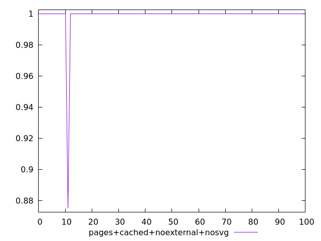
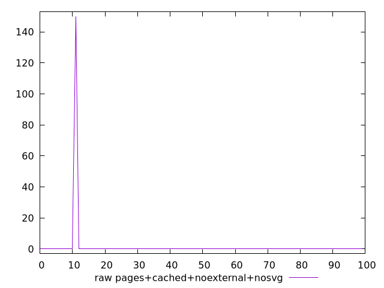

# Report pages+cached+noexternal+nosvg

[parent..](./..)  


## Scores

  

## Score Histogram

  

## Score Indicators

```yaml
min: 0.875
max: 1
range: 0.125
mean: 0.99875
median: 1
stdev: 0.012437342963832749
skewness: -9.84937058954032
eccentricity: 0.20100756305183815
quanta: 2
quantaRatio: 0.02
p90range: 0
p90stdev: 1
p90eccentricity: 0.20100756305183815
p90quanta: 1
p90quantaRatio: 0.011111111111111112
outlandishness: 0.9975015625000001

```

## Raw Values

  

## Raw Values Histogram

  

## Raw Indicators

```yaml
min: 0
max: 150
range: 150
mean: 1.5
median: 0
stdev: 14.9248115565993
skewness: 9.849370589540309
eccentricity: 0.2010075630518424
quanta: 2
quantaRatio: 0.02
p90range: 0
p90stdev: 0
p90eccentricity: 0.2010075630518424
p90quanta: 1
p90quantaRatio: 0.011111111111111112
outlandishness: .inf

```

<style>
  img {
    max-width: 80%;
  }
</style>
      
