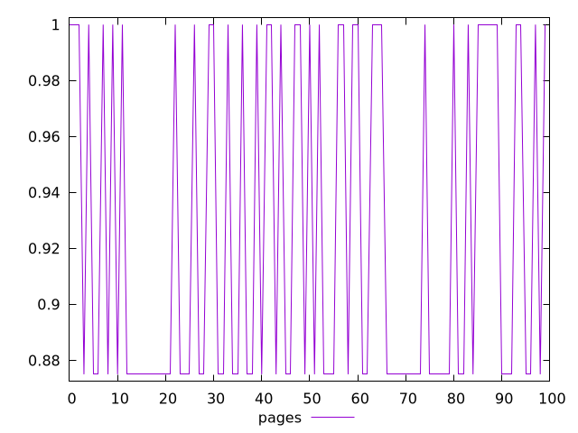
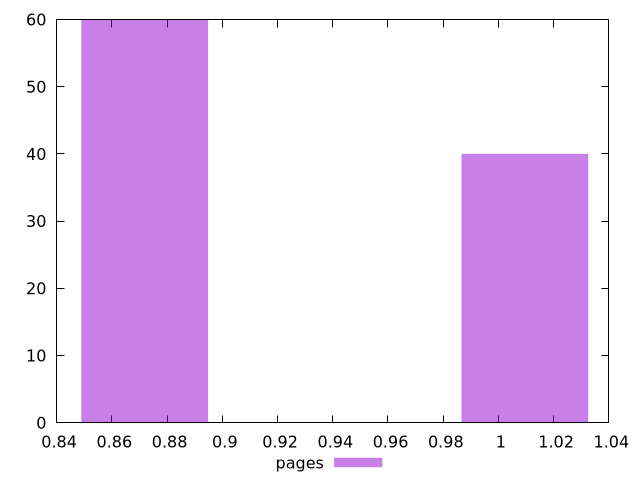
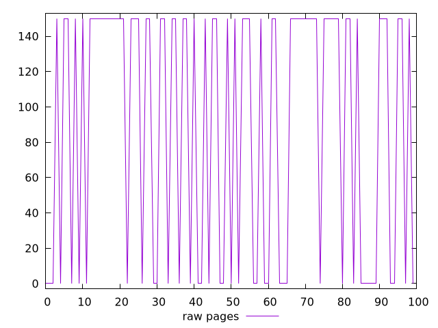
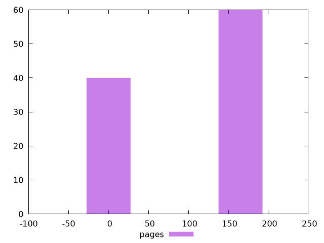

# Report pages

[parent..](./..)  


## Scores

  

## Score Histogram

  

## Score Indicators

```yaml
min: 0.875
max: 1
range: 0.125
mean: 0.925
median: 0.875
stdev: 0.061237243569579436
skewness: 0.4082482904638613
eccentricity: 1.632993161855452
quanta: 2
quantaRatio: 0.02
p90range: 0.125
p90stdev: 0.875
p90eccentricity: 1.632993161855452
p90quanta: 2
p90quantaRatio: 0.022222222222222223
outlandishness: 1.0182644628099178

```

## Raw Values

  

## Raw Values Histogram

  

## Raw Indicators

```yaml
min: 0
max: 150
range: 150
mean: 90
median: 150
stdev: 73.48469228349535
skewness: -0.40824829046386263
eccentricity: 1.6329931618554518
quanta: 2
quantaRatio: 0.02
p90range: 150
p90stdev: 150
p90eccentricity: 1.6329931618554518
p90quanta: 2
p90quantaRatio: 0.022222222222222223
outlandishness: 0.81

```

<style>
  img {
    max-width: 80%;
  }
</style>
      
