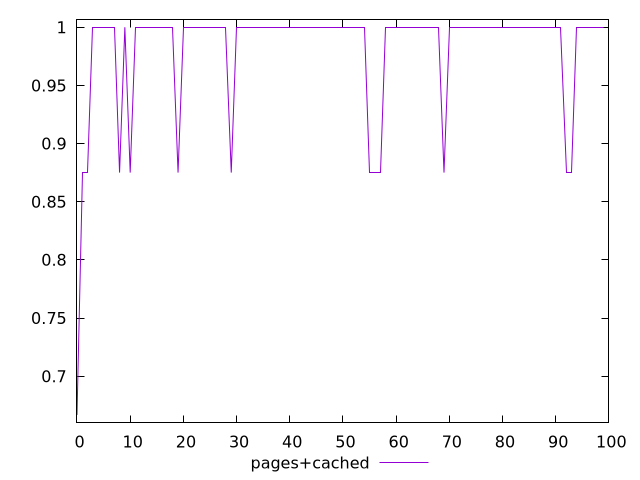
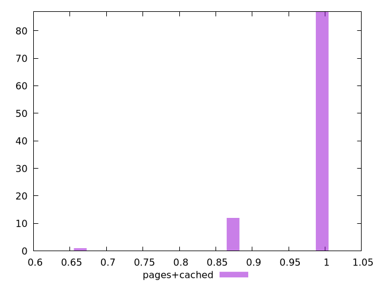
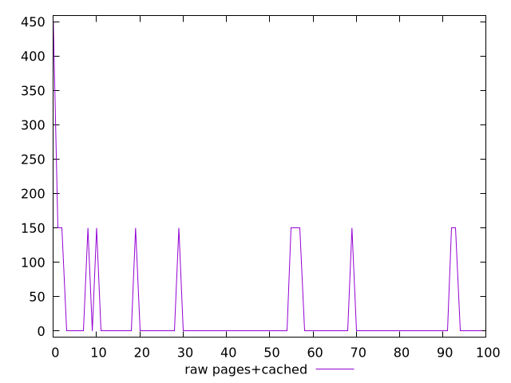
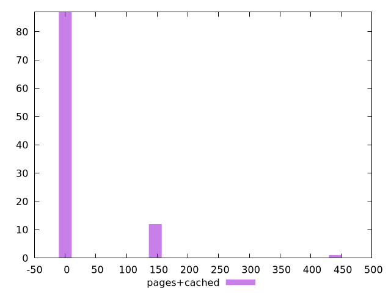

# Report pages+cached

[parent..](./..)  


## Scores

  

## Score Histogram

  

## Score Indicators

```yaml
min: 0.6666666666666666
max: 1
range: 0.33333333333333337
mean: 0.9816666666666667
median: 1
stdev: 0.051478150704935
skewness: -3.319476337137985
eccentricity: 0.7122762990619951
quanta: 3
quantaRatio: 0.03
p90range: 0.125
p90stdev: 1
p90eccentricity: 0.7122762990619951
p90quanta: 2
p90quantaRatio: 0.022222222222222223
outlandishness: 0.9717504945641708

```

## Raw Values

  

## Raw Values Histogram

  

## Raw Indicators

```yaml
min: 0
max: 450
range: 450
mean: 22.5
median: 0
stdev: 64.9519052838329
skewness: 3.7227545357347145
eccentricity: 0.6928203230275509
quanta: 3
quantaRatio: 0.03
p90range: 150
p90stdev: 0
p90eccentricity: 0.6928203230275509
p90quanta: 2
p90quantaRatio: 0.022222222222222223
outlandishness: 20.25

```

<style>
  img {
    max-width: 80%;
  }
</style>
      
