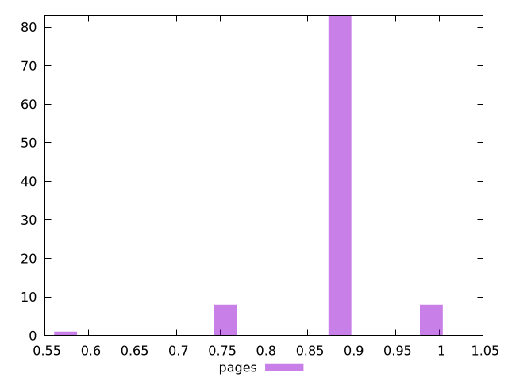

# Report pages

[parent..](./..)  


## Scores

  

## Score Histogram

  

## Score Indicators

```yaml
min: 0.5833333333333334
max: 1
range: 0.41666666666666663
mean: 0.8720833333333334
median: 0.875
stdev: 0.05781165539923582
skewness: -1.1326633597409466
eccentricity: 0.7928043751180867
quanta: 4
quantaRatio: 0.04
p90range: 0.125
p90stdev: 0.875
p90eccentricity: 0.7928043751180867
p90quanta: 2
p90quantaRatio: 0.022222222222222223
outlandishness: 1.0157921979548037

```

## Raw Values

  

## Raw Values Histogram

  

## Raw Indicators

```yaml
min: 0
max: 600
range: 600
mean: 154.5
median: 150
stdev: 74.86487828080668
skewness: 1.9911746602423435
eccentricity: 0.761371704715818
quanta: 4
quantaRatio: 0.04
p90range: 150
p90stdev: 150
p90eccentricity: 0.761371704715818
p90quanta: 2
p90quantaRatio: 0.022222222222222223
outlandishness: 0.9133053459453715

```

<style>
  img {
    max-width: 80%;
  }
</style>
      
